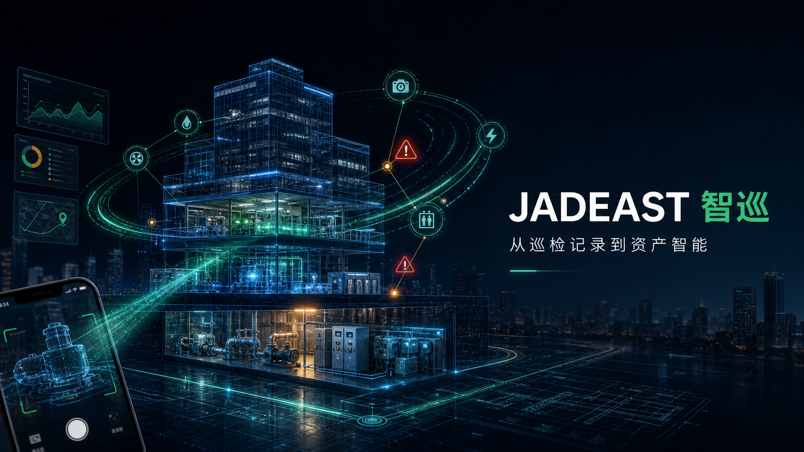
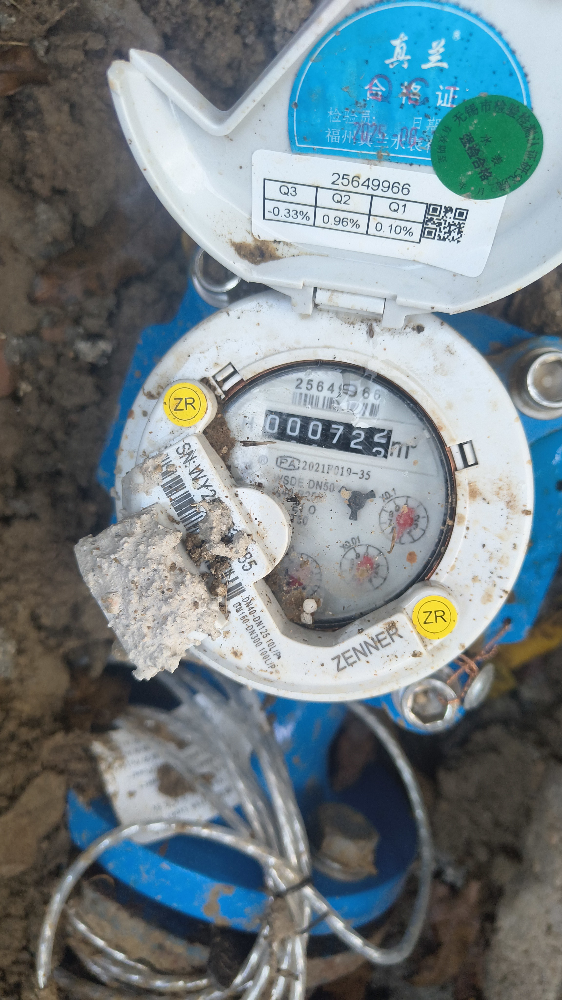
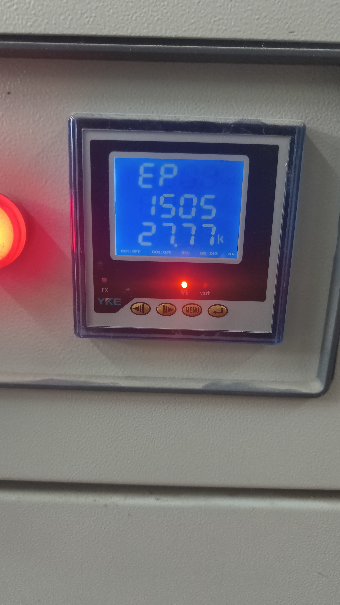
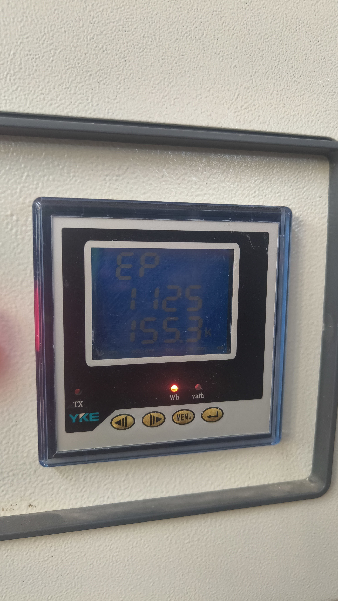
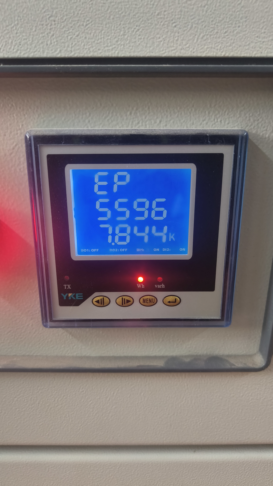
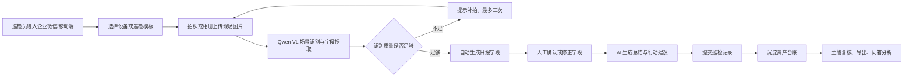
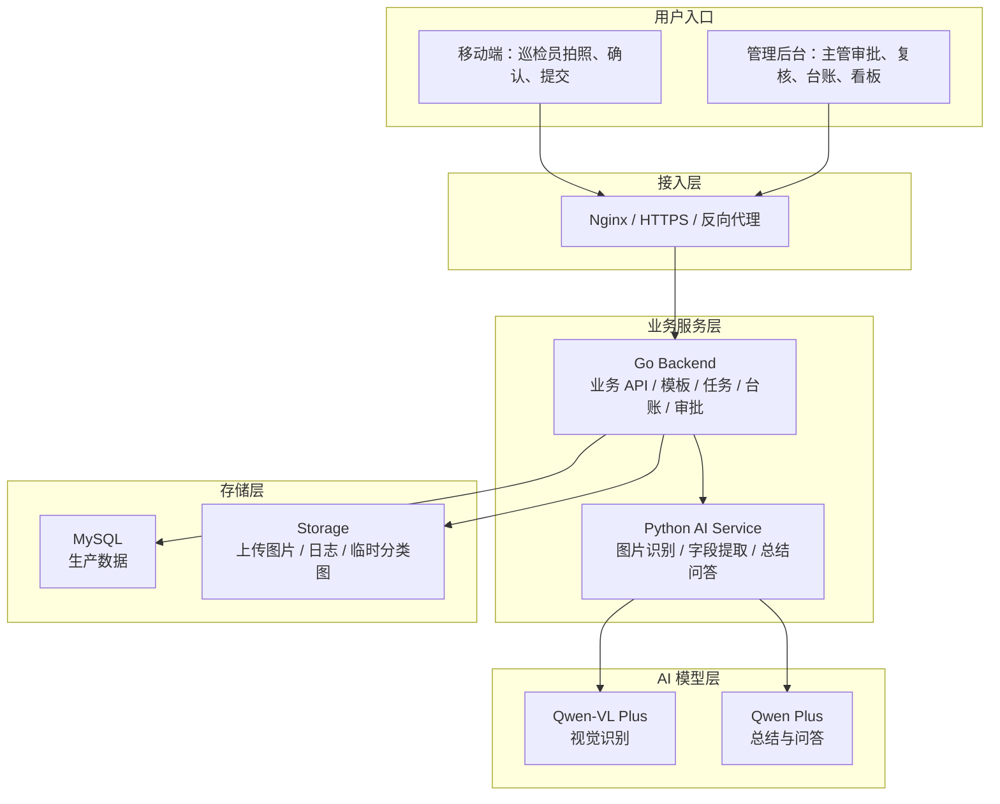
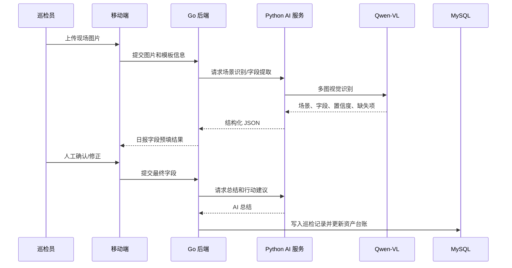
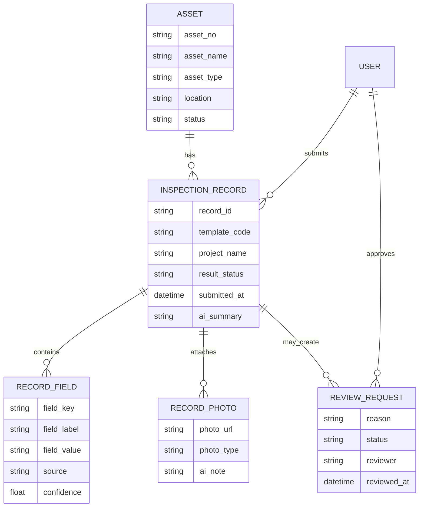

# 智巡 InspectAI

> 面向楼宇、园区、物业和设施运维团队的 AI 巡检与资产台账平台。  
> 核心闭环：**拍照取证 → AI 识别 → 人工确认 → 异常复核 → 台账沉淀 → 管理复盘**。




---

## 项目定位

传统巡检最大的问题不是“能不能填表”，而是现场证据、表单字段、异常判断和后续台账之间长期割裂。巡检员要拍照片、对检查项、抄读数、写日报；主管还要再从日报里翻异常、追问题、做周报。智巡把这一条链路压缩到一个系统里：一线只负责拍照和确认，AI 负责识别、预填、提示风险，后台负责审批、台账和复盘。

当前演示主线聚焦 **资产台账中的电梯设备巡检**：新手巡检员按设备拍照，AI 自动匹配电梯巡检模板，识别现场状态，提示漏拍或风险项，确认后沉淀为巡检记录，并关联到资产台账，主管可以按设备查看历史、导出记录、复核异常。

---

## 界面预览

| 移动端入口 | 管理端登录 | 真实巡检样例 |
|---|---|---|
|  |  |  |

| 电表识别样例 | 配电面板样例 | 异常/漏拍补充样例 |
|---|---|---|
|  |  |  |

---

## 业务闭环



这条流程的关键不是让 AI 直接替人下结论，而是让 AI 先做“识别、提示、预填、对比”，再把最终确认权交给人。这样既能减少一线重复录入，又能保证台账里的数据可追溯、可复核。

---

## 技术架构



### 服务职责

| 模块 | 职责 | 默认端口 |
|---|---|---|
| 移动端 | 巡检员拍照、上传、字段确认、提交日报 | `18080` |
| Go 后端 | API、模板、任务、资产台账、审批、导出 | `18080` |
| 管理后台 | 主管看板、资产台账、异常复核、数据中心 | `18081` |
| AI 微服务 | 调用千问视觉模型、文本模型、返回结构化结果 | `19100` |
| MySQL | 生产数据库，沉淀巡检记录、资产、任务、审批 | `3306` |

---

## AI 工作方式



AI 部分当前采用“保守识别”策略：能看清的字段才填，无法确认的字段标记为需人工复核；关键图片缺失时提示补拍，不用编造数据污染台账。对于数字读数类场景，提示词会要求模型保留原始读数、单位、小数点位置和置信度，最终仍由人工确认后入库。

---

## 当前能力

| 能力域 | 已实现内容 |
|---|---|
| 移动端巡检 | 拍照识别、相册上传、手动选模板、字段确认、失败重拍、人工兜底 |
| AI 识别 | 场景分类、表单字段提取、缺失照片提示、AI 总结、行动建议 |
| 巡检管理 | 巡检计划、巡检任务、巡检记录、状态追踪、导出 |
| 资产台账 | 设备档案、历史巡检、最近状态、异常摘要、记录关联 |
| 异常处理 | 异常复核、修改申请、主管审批、操作留痕 |
| 数据看板 | 巡检趋势、资产状态、异常统计、AI 问答辅助 |
| 部署能力 | 本地一键启动、Docker Compose 生产部署、MySQL、Docker Secret、Nginx |

---

## 演示主线

完整演示手稿见 [docs/DEMO.md](docs/DEMO.md)。

建议演示按一条线讲完，避免来回跳页面：

1. 移动端进入巡检，选择“无机房电梯”模板。
2. 上传电梯现场照片，模拟新手漏拍按钮面板。
3. AI 自动识别为电梯巡检，预填检查字段。
4. 系统提示缺失关键照片或风险项，巡检员提交修改申请。
5. 管理后台收到审批，主管处理后进入台账。
6. 在资产台账筛选“无机房电梯”，查看该设备历史巡检。
7. 导出巡检记录，说明主管不再逐条翻日报，而是看 AI 摘要和趋势变化。

---

## 快速启动

### 本地开发

```powershell
cd inspectai
.\scripts\setup-key.ps1
.\scripts\start-local.ps1
.\scripts\start-admin.ps1
```

访问入口：

| 入口 | 地址 |
|---|---|
| 移动端 / Go 后端 | <http://127.0.0.1:18080> |
| 管理后台 | <http://127.0.0.1:18081> |
| AI 健康检查 | <http://127.0.0.1:19100/health> |

健康检查：

```powershell
curl --noproxy "*" http://127.0.0.1:18080/health
curl --noproxy "*" http://127.0.0.1:19100/health
```

停止服务：

```powershell
.\scripts\stop-admin.ps1
.\scripts\stop-local.ps1
```

### 服务器部署

服务器部署文档见 [inspectai/docs/DEPLOY.md](inspectai/docs/DEPLOY.md)。

```bash
git clone https://github.com/Remenber-hxh/5-6--ai---.git
cd 5-6--ai---/inspectai

cp .env.prod.example .env.prod
# 编辑 .env.prod，只写非敏感配置

export DASHSCOPE_API_KEY="sk-xxx"
export MYSQL_PASSWORD="change-me"
export MYSQL_ROOT_PASSWORD="change-me"
export INSPECTAI_ADMIN_PASSWORD="change-me"

bash scripts/prepare-secrets.sh
bash scripts/deploy-linux.sh
```

生产部署约束：

| 项目 | 要求 |
|---|---|
| 域名 | 企业微信可信域名需要指向服务器 |
| HTTPS | Nginx 侧配置证书，企业微信内访问必须 HTTPS |
| 密钥 | 千问 Key、MySQL 密码、管理员密码走 Docker Secret |
| 数据库 | 生产使用 MySQL，不建议用 SQLite |
| 备份 | MySQL 和上传图片目录需要定期备份 |
| 日志 | `storage/logs` 保留启动、AI、后端、管理端日志 |

---

## 目录结构

```text
.
├─ README.md                         项目总览，适合 GitHub 首页展示
├─ docs/
│  └─ DEMO.md                        演示手稿与讲解脚本
└─ inspectai/
   ├─ go-backend/                    Go 业务后端
   ├─ ai-service/                    Python AI 微服务与 prompts
   ├─ frontend/                      移动端页面
   ├─ admin-frontend/                管理后台页面
   ├─ nginx/                         生产反向代理配置
   ├─ scripts/                       启停、密钥、部署、打包脚本
   ├─ storage/                       本地运行数据，已 gitignore
   ├─ docs/
   │  └─ DEPLOY.md                   服务器部署指南
   ├─ docker-compose.yml             本地/开发编排
   └─ docker-compose.prod.yml        生产部署编排
```

---

## 数据沉淀方式



资产台账保存的是“设备长期档案”，巡检记录保存的是“某一次巡检事实”。两者分开后，主管既能看单次问题，也能看同一设备长期趋势。

---

## 路线图

### 近期

- 企业微信 OAuth / SSO 接入，替代轻量令牌登录。
- 审批通过后的状态联动继续增强，让异常闭环更直观。
- AI 行动建议在移动端和管理端进一步突出。
- 数据导出模板标准化，贴近日常汇报口径。

### 中期

- 多租户与项目级权限，支持多个园区或物业项目共用。
- 设备健康评分、趋势预警、周度/月度自动摘要。
- 对象存储接入，图片从本地磁盘迁移到 OSS/S3。
- CI/CD 与镜像仓库，形成可回滚的版本发布流程。

### 长期

- 接入智能穿戴设备，支持语音、视频、定位和现场传感数据。
- 接入 MQTT / Modbus / IoT 网关，实现 AI 巡检与设备实时数据互证。
- 和 BIM / 数字孪生结合，把巡检记录挂到具体楼层、房间、设备。

---

## 项目边界

当前版本适合演示、试点和小范围内部验证；如果要正式生产上线，建议优先补齐：

- 企业微信身份体系和细粒度权限。
- 数据库备份、日志留存、异常告警。
- 更完整的测试覆盖和 CI/CD。
- AI 识别结果的人工复核规范。
- 图片长期存储、脱敏和访问权限控制。

---

## 维护者

- 项目仓库：[Remenber-hxh/5-6--ai---](https://github.com/Remenber-hxh/5-6--ai---)
- 项目名称：智巡 InspectAI
- 当前 License：未声明，默认不开放商用复用授权。
