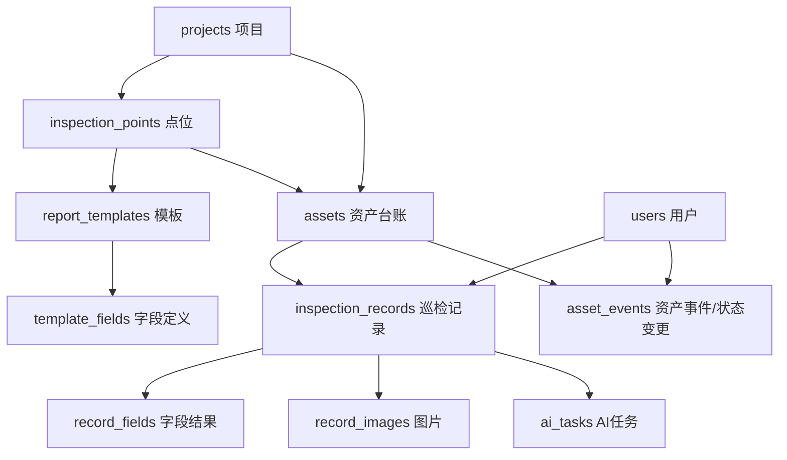

# 台账与项目管理重构方案

> 日期：2026-05-13  
> 目的：把当前 demo 版“填报即台账”升级为可长期维护的项目管理 + 资产台账 + 巡检记录系统。  
> 结论：当前版本适合演示，但项目、点位、模板仍写死在代码里；如果后续要上服务器长期用，需要把“移动端填报”和“后台管理”拆开，并把项目管理、资产台账、巡检记录、AI 任务分账管理。

## 1. 当前版本实际情况

当前系统已经具备第一版闭环：

- 用户拍照或上传图片。
- AI 判断场景和模板。
- 后端创建巡检记录。
- AI 按模板识别字段。
- 人工确认或修改字段。
- 提交日报。
- AI 根据最终字段生成总结。
- 后端把结果写入资产台账。

当前 MySQL 里主要有三张表：

| 表 | 当前作用 | 问题 |
| --- | --- | --- |
| `records` | 每一次巡检日报记录，字段和图片以 JSON 存储 | 适合快速开发，但后续统计、筛选、维护会困难 |
| `assets` | 资产台账快照，只存最近状态、最近总结、最近记录 ID | 不是真正的资产主数据，很多资产信息缺失 |
| `ai_tasks` | AI 分析任务日志 | 可用，但缺少模型成本、失败分类、人工修正对比等运维指标 |

当前项目、点位、模板不是数据库配置，而是写死在 Go 代码里：

```text
reportTemplates()  // 写死日报模板
seedPoints()       // 写死巡检点位
```

这意味着：

- 后台无法新增项目。
- 后台无法新增点位。
- 后台无法调整模板字段。
- 后台无法维护资产基础信息。
- 云端上线后，如果业务方要加一个巡检点，需要改代码、重新构建、重新部署。

## 2. 当前台账的核心隐患

### 2.1 资产 ID 依赖用户填写内容

当前资产 ID 由以下逻辑推导：

```text
project + templateId + asset_no / site / point_id
```

问题是 `site` 和 `asset_no` 可能来自人工填写。

例如同一个办公室可能被填成：

```text
办公室
办公区
紫涵办公室
紫涵雅集办公室
```

系统就可能把同一个资产拆成多条台账。

这对 demo 影响不大，但长期使用会导致：

- 台账重复。
- 历史记录分散。
- 趋势分析失真。
- 管理员需要人工合并数据。

### 2.2 资产台账不是资产主数据

当前 `assets` 表更像“最近一次巡检结果缓存”，不是完整资产台账。

它缺少：

- 资产编号。
- 资产位置。
- 所属项目 ID。
- 所属点位 ID。
- 责任人。
- 维护单位。
- 启用/停用状态。
- 资产创建来源。
- 资产变更记录。

所以现在只能回答：

```text
最近一次巡检是什么状态？
累计巡检几次？
最近总结是什么？
```

但很难回答：

```text
这个项目有哪些资产？
某个区域有哪些未巡检资产？
哪些资产连续三次异常？
谁负责这个资产？
资产名称是谁改的？
为什么状态从正常改成待维修？
```

### 2.3 项目管理和巡检填报耦合

当前模板里直接写了 `Project` 和 `AssetType`。

这会导致：

- 模板和项目绑定过死。
- 同一个模板无法轻松复用到多个项目。
- 项目改名、点位调整需要改代码。
- 后续做多项目、多物业、多人员权限时会很被动。

### 2.4 字段 JSON 影响后续统计

当前 `records.fields_json` 保存所有字段。

优点：

- 开发快。
- 模板变化时兼容性强。
- 第一版演示足够。

缺点：

- 查询某个字段很麻烦。
- 做趋势统计麻烦。
- 做异常筛选麻烦。
- 做“AI 识别值 vs 人工修正值”分析麻烦。
- 后台表格无法高效分页、排序、筛选。

如果后续要看：

```text
水表 30 天读数变化
温度超过阈值的点位
AI 经常识别错的字段
人工修改率最高的模板
```

就必须把字段拆成明细表。

## 3. 建议重新分账

后续系统不应该只有一张“资产台账”，而应该拆成四本账。

### 3.1 项目管理账

负责管理：

- 项目。
- 楼宇。
- 区域。
- 巡检点位。
- 绑定模板。
- 巡检频率。
- 项目启停。

这本账由管理员维护。

### 3.2 资产台账

负责管理真实资产本体：

- UPS 主机。
- 水表。
- 电表。
- 热水机房。
- 消防泵房。
- 生活水泵房。
- 配电箱。
- 强电井。

这本账由管理员或主管维护。

### 3.3 巡检记录账

负责记录每一次现场巡检：

- 谁巡检。
- 什么时候巡检。
- 拍了哪些照片。
- AI 识别了什么。
- 人工修改了什么。
- 最终提交了什么。
- 是否异常。

这本账是一线操作形成的事实记录。

### 3.4 AI 任务账

负责记录 AI 服务过程：

- 调用了哪个模型。
- 图片数量。
- 耗时。
- 成功/失败。
- 失败原因。
- 返回置信度。
- 是否被人工修改。

这本账由系统维护人看，用于排查和优化模型。

## 4. 推荐数据模型

下一版建议从三张表扩展为以下核心表。

```text
projects
inspection_points
report_templates
template_fields
assets
inspection_records
record_fields
record_images
ai_tasks
asset_events
users
```

关系如下：



## 5. 表结构建议

### 5.1 `projects` 项目表

用于替代代码里的固定项目名。

```text
id
name
code
description
status              active / inactive
created_at
updated_at
```

维护意义：

- 项目可以后台新增。
- 项目可以停用。
- 后续可以按项目做权限。
- 项目名变化不影响历史数据。

### 5.2 `inspection_points` 点位表

用于替代 `seedPoints()`。

```text
id
project_id
name
code
type
location
template_id
sort_order
status
created_at
updated_at
```

维护意义：

- 后台可以新增点位。
- 点位可以绑定不同模板。
- 点位可以排序。
- 停用点位不会影响历史记录。

### 5.3 `report_templates` 模板表

用于替代 `reportTemplates()` 中的模板主体。

```text
id
name
asset_type
max_images
has_ai
ai_prompt
status
created_at
updated_at
```

维护意义：

- 模板可以后台管理。
- 同一模板可以被多个项目或点位复用。
- 后续新增模板不用改代码。

### 5.4 `template_fields` 模板字段表

用于替代模板里的 `Fields` 数组。

```text
id
template_id
field_code
field_label
field_kind          text / number / choice
required
source              ai / manual
options_json
sort_order
created_at
updated_at
```

维护意义：

- 字段可以排序。
- 可维护必填字段。
- 可维护选项。
- AI 字段和人工字段边界清晰。
- 后续可以统计某字段识别准确率。

### 5.5 `assets` 资产台账表

应从“最近巡检快照”升级为“资产主数据”。

```text
id
project_id
point_id
asset_code
asset_name
asset_type
location
owner
maintainer
status              normal / abnormal / pending_review / repair / inactive
last_record_id
last_inspected_at
inspection_count
created_source      admin / inspection / import
created_at
updated_at
```

维护意义：

- 资产可以先由管理员创建。
- 资产可以绑定项目和点位。
- 资产编号稳定，不依赖用户随手填写。
- 后续可以做资产生命周期管理。

### 5.6 `inspection_records` 巡检记录表

用于承接现在 `records` 的主体信息。

```text
id
project_id
point_id
asset_id
template_id
inspector_id
inspector_name
recognition_status
manual_required
retake_reason
capture_attempts
submitted
submitted_at
ai_summary
ai_summary_tags_json
ai_recommendations_json
ai_summary_error
created_at
updated_at
```

维护意义：

- 每次巡检有明确资产归属。
- 可以按项目、点位、资产、人员、时间查记录。
- 可以做异常追踪。

### 5.7 `record_fields` 巡检字段明细表

用于拆分现在的 `fields_json`。

```text
id
record_id
field_code
field_label
field_kind
value
ai_value
source              ai / manual / human-confirmed / human-edited
confidence
needs_review
reason
version
created_at
updated_at
```

维护意义：

- 能统计字段级别数据。
- 能分析 AI 识别准确率。
- 能分析人工修改率。
- 能做趋势图。

### 5.8 `record_images` 图片表

用于拆分现在的 `images_json`。

```text
id
record_id
file_name
path
content_hash
size
sort_order
created_at
```

维护意义：

- 图片可以单独管理。
- 历史记录图片查询更方便。
- 后续可接对象存储。

### 5.9 `ai_tasks` AI 任务表

保留当前表，但建议增强字段。

```text
id
record_id
task_type           classify / analyze / summarize
provider
model
status
duration_ms
image_count
prompt_name
error_code
error_message
analysis_json
created_at
updated_at
```

维护意义：

- 能看不同模型效果。
- 能看耗时。
- 能看失败原因。
- 能判断是图片问题、prompt 问题还是接口问题。

### 5.10 `asset_events` 资产事件表

用于记录资产状态变更。

```text
id
asset_id
record_id
event_type          status_change / manual_edit / inspection_submitted / repair_note
old_value
new_value
operator_id
operator_name
remark
created_at
```

维护意义：

- 谁改了台账可以追踪。
- 状态为什么变化可以追踪。
- 异常处理可以形成闭环。

### 5.11 `users` 用户表

第一版可以简单，后续接企业微信。

```text
id
wework_user_id
name
mobile
role                inspector / supervisor / admin
status
created_at
updated_at
```

维护意义：

- 巡检员和管理员分权。
- 可接企业微信身份。
- 后续可以按项目授权。

## 6. 新业务流程

### 6.1 管理员先维护基础数据

后台先维护：

```text
项目
点位
模板
资产
人员
```

资产不是等用户提交后才随机生成，而是可以提前建立。

### 6.2 巡检员移动端只做现场操作

移动端流程保持简单：

```text
进入企业微信应用
拍照
AI 判断场景
匹配点位/资产
AI 识别字段
人工确认
提交日报
```

一线人员不应该承担复杂后台管理。

### 6.3 资产匹配逻辑

推荐匹配优先级：

```text
1. 如果图片或字段中识别到 asset_code，优先匹配 asset_code。
2. 如果没有 asset_code，用 point_id + template_id 匹配默认资产。
3. 如果还无法匹配，进入待归档资产池。
4. 管理员确认后，绑定到已有资产或创建新资产。
```

这样可以避免因为 `site` 填写不一致导致重复资产。

### 6.4 提交后更新台账

提交巡检记录后：

```text
更新 inspection_records
写入 record_fields
写入 record_images
更新 assets.last_record_id
更新 assets.status
更新 assets.last_inspected_at
inspection_count + 1
写入 asset_events
```

注意：AI 总结只能追加到巡检记录或台账备注，不能反向覆盖人工确认字段。

## 7. 后台管理界面建议

建议新增独立后台入口：

```text
/admin
```

不要把全部后台能力塞进移动端。移动端是给一线拍照，后台是给主管和管理员管理。

### 7.1 首页概览

展示：

- 今日巡检数。
- 今日异常数。
- 待复核数。
- 待维修数。
- AI 失败数。
- 最近异常资产。

### 7.2 项目管理

功能：

- 新增项目。
- 编辑项目名称。
- 启用/停用项目。
- 查看项目下点位和资产数量。

### 7.3 点位管理

功能：

- 新增点位。
- 编辑点位位置。
- 绑定模板。
- 设置是否移动端显示。
- 设置排序。

### 7.4 模板管理

功能：

- 查看模板。
- 配置字段。
- 配置字段类型。
- 配置是否 AI 识别。
- 配置选项。
- 绑定 prompt。

第一阶段可以只读展示，第二阶段再允许编辑。

### 7.5 资产台账

功能：

- 资产列表。
- 按项目筛选。
- 按状态筛选。
- 按资产类型筛选。
- 编辑资产名称、编号、位置、责任人、状态。
- 查看最近巡检。
- 查看历史巡检。
- 查看状态变更记录。

### 7.6 巡检记录

功能：

- 查看所有记录。
- 按项目、点位、资产、日期、状态筛选。
- 查看照片。
- 查看字段。
- 查看 AI 总结。
- 允许管理员修正历史字段。

### 7.7 异常处理

功能：

- 只展示异常、待复核、待维修。
- 记录处理备注。
- 关闭异常。
- 生成异常处理历史。

### 7.8 AI 任务日志

功能：

- 查看识别成功率。
- 查看失败任务。
- 查看失败原因。
- 查看模型耗时。
- 查看低置信度字段。
- 查看人工修改最多的字段。

### 7.9 系统配置

功能：

- 千问 API Key 状态。
- 企业微信配置。
- 可信域名。
- 上传大小限制。
- 模型选择。

密钥不要在页面明文展示，只显示是否已配置。

## 8. 权限分工

建议至少三类角色。

| 角色 | 权限 |
| --- | --- |
| 巡检员 | 移动端拍照、填写、提交、查看自己的记录 |
| 主管 | 查看项目台账、查看巡检记录、处理异常、修正记录 |
| 管理员 | 项目、点位、模板、资产、人员、系统配置 |

权限原则：

- 巡检员不直接维护资产主数据。
- 主管可以修正历史记录，但应留痕。
- 管理员可以配置项目和模板。
- AI 不能绕过人工确认。

## 9. 后期维护重点

### 9.1 数据维护

必须避免台账重复。

建议维护机制：

- 资产编号必须稳定。
- 后台提供重复资产合并功能。
- 自动生成资产时进入待确认状态。
- 管理员确认后再成为正式资产。

长期维护时要定期检查：

- 是否有同名资产。
- 是否有长期未巡检资产。
- 是否有连续异常资产。
- 是否有重复点位。
- 是否有无资产归属的记录。

### 9.2 模板维护

模板是后期最容易变的地方。

建议：

- 模板字段配置入库。
- 模板启用版本号。
- 历史记录保留当时的字段快照。
- 修改模板不影响历史记录。

否则以后业务方改表单字段，会导致历史数据和新数据混在一起。

### 9.3 AI Prompt 维护

Prompt 不应散落在代码里无法追踪。

建议：

- Prompt 文件继续保留。
- 数据库记录模板绑定的 prompt 名称。
- `ai_tasks` 记录每次使用的 prompt 名称和模型。
- 重大 prompt 修改要保留版本。

后续排查 AI 识别效果时，需要知道：

```text
当时用的是哪个模型？
当时用的是哪个 prompt？
返回置信度是多少？
用户最后改了哪些字段？
```

### 9.4 图片维护

图片会占用大量空间。

建议：

- 本地开发继续用 `storage/uploads`。
- 云端后期迁移到对象存储。
- 数据库只保存图片 URL、hash、大小。
- 定期清理 `tmp_classify`。
- 保留正式提交记录的图片。

不要随便删除已提交记录图片，否则历史日报无法追溯。

### 9.5 数据库维护

当前 MySQL 适合继续用，但需要加维护机制。

建议：

- 每日自动备份 MySQL。
- 每日备份上传图片。
- 备份至少保留 7 天。
- 重大升级前先备份。
- 数据库结构变更用迁移脚本，不要手工改表。

后期建议增加：

```text
migrations/
  001_initial.sql
  002_add_projects.sql
  003_split_record_fields.sql
```

这样服务器和本地结构不会漂移。

### 9.6 操作留痕

后台一旦允许编辑，就必须留痕。

建议：

- 修改资产状态写入 `asset_events`。
- 修改历史字段写入审计日志。
- 修改人、修改时间、修改前、修改后都要记录。

否则后期出现争议时无法解释：

```text
这个异常是谁改成正常的？
这个读数是谁改的？
为什么日报和台账不一致？
```

### 9.7 监控和故障排查

上线后至少要能看：

- 后端是否存活。
- AI 服务是否存活。
- MySQL 是否存活。
- DashScope Key 是否有效。
- AI 失败率是否异常。
- 上传目录是否快满。

建议接口：

```text
GET /health
GET /api/admin/health
GET /api/admin/ai-stats
GET /api/admin/storage-stats
```

## 10. 推荐落地路线

不要一次推翻现有系统。建议分三阶段。

### 第一阶段：后台管理壳 + 台账增强

目标：不影响移动端演示，先补后台。

新增：

```text
/admin
/api/admin/dashboard
/api/admin/assets
/api/admin/records
/api/admin/ai-tasks
```

保留现有 `records/assets/ai_tasks` 表。

这一阶段重点：

- 主管能看台账。
- 主管能筛选异常。
- 主管能查看历史记录。
- 主管能修正资产状态和备注。

### 第二阶段：项目、点位、模板入库

目标：摆脱写死代码。

新增表：

```text
projects
inspection_points
report_templates
template_fields
```

后台支持：

- 项目新增。
- 点位新增。
- 点位绑定模板。
- 模板字段查看。

这一阶段后，新增项目不需要改 Go 代码。

### 第三阶段：字段和图片拆表

目标：支持统计和长期维护。

新增表：

```text
record_fields
record_images
asset_events
```

这一阶段可以做：

- 字段趋势图。
- AI 准确率统计。
- 人工修改率统计。
- 异常闭环。
- 图片归档管理。

## 11. 第一阶段最小接口建议

为了尽快落地，第一阶段先做这些接口。

```text
GET    /api/admin/dashboard
GET    /api/admin/assets
GET    /api/admin/assets/{id}
PATCH  /api/admin/assets/{id}
GET    /api/admin/records
GET    /api/admin/records/{id}
PATCH  /api/admin/records/{id}
GET    /api/admin/ai-tasks
```

筛选参数：

```text
project
assetType
status
dateFrom
dateTo
keyword
submitted
recognitionStatus
```

## 12. 对当前代码的改造建议

短期不要动 AI 主链路。

优先级如下：

1. 新增 `/admin` 页面。
2. 把资产台账从移动端弹层升级为后台列表 + 详情。
3. 把巡检记录做成后台列表。
4. 增加 dashboard 统计。
5. 增加 AI 任务日志页面。
6. 再考虑项目和模板入库。

原因：

- AI 链路目前已经能演示。
- 最大短板是管理侧。
- 管理侧补起来后，领导更容易理解系统价值。
- 数据库重构要谨慎，不应在演示前夕大改。

## 13. 管理价值表达

后续汇报时可以这样讲：

```text
第一版解决的是一线填报效率：拍照、识别、确认、提交。
第二版要解决的是管理沉淀：项目、点位、资产、巡检记录和异常处理形成统一后台。
台账不是简单保存一条日报，而是把每一次巡检沉淀到资产生命周期里。
后期系统能回答“谁巡了、巡了什么、哪里异常、谁处理、是否复发、AI 是否稳定”这些管理问题。
```

## 14. 关键结论

当前系统已经完成“填报闭环”，下一阶段重点不是继续堆 AI 功能，而是补“管理闭环”。

管理闭环包括：

- 项目可维护。
- 点位可维护。
- 资产可维护。
- 巡检记录可追溯。
- 异常可闭环。
- AI 识别质量可评估。
- 数据库升级可迁移。
- 操作修改可留痕。

只有做到这些，系统才能从 demo 变成可以长期运行的工程巡检平台。

