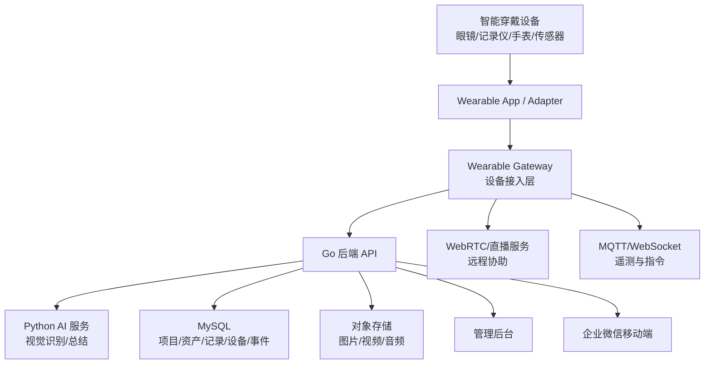

# 智能穿戴设备接入与巡检方案书

> 日期：2026-05-13  
> 适用项目：智巡秒填 / InspectAI Assistant  
> 目标：为后期接入智能眼镜、头戴计算机、胸前记录仪、智能手表、BLE 传感器等智能穿戴设备预留接口和业务流程，使系统从“手机拍照填报”升级为“穿戴式现场巡检 + 远程协同 + 安全监测 + 自动台账沉淀”。

## 1. 方案结论

后期不要把智能穿戴设备理解成“换一个拍照入口”。它应该承担四类能力：

```text
1. 现场采集：拍照、录像、语音、扫码、定位、传感器数据。
2. 巡检引导：任务下发、点位提示、语音操作、重拍提醒、异常提示。
3. 远程协同：一线人员第一视角视频，后台专家实时指导。
4. 安全监测：跌倒、心率、疲劳、离岗、危险区域、SOS。
```

当前系统的主流程是：

```text
手机拍照 → AI 识别 → 人工确认 → 生成日报 → 更新台账
```

智能穿戴版本应升级为：

```text
任务下发 → 穿戴设备到点 → 第一视角采集 → AI 实时质检 → AI 字段识别 → 语音/手势确认 → 异常协同 → 自动提交 → 台账与事件沉淀
```

## 2. 当前智能穿戴设备形态

按工程巡检场景，不建议只考虑普通消费手表。应分成四类设备。

### 2.1 AR 智能眼镜 / 头戴计算机

代表形态：

- RealWear Navigator 系列。
- Vuzix M400 / M4000。
- Rokid / 亮亮视野 / 影目等国产工业 AR 设备。
- 其他 Android-based 工业头戴终端。

适合场景：

- 双手被占用的机房、泵房、配电间巡检。
- 需要第一视角拍照。
- 需要语音控制。
- 需要远程专家看到现场画面。
- 需要边看设备边看提示。

优点：

- 第一视角天然适合巡检。
- 可语音操作，减少手点屏幕。
- 可显示下一步巡检提示。
- 可做远程协助。
- 部分设备支持热成像、可见光摄像头、降噪麦克风。

局限：

- 价格高。
- 续航和佩戴舒适度需要验证。
- 不同厂商 SDK 差异大。
- 户外强光、弱网、设备发热需要测试。

### 2.2 胸前记录仪 / 工牌式记录仪

适合场景：

- 保安、物业、巡逻、保洁、工程巡查。
- 需要持续录像留证。
- 不需要 AR 显示，但需要自动记录。

优点：

- 成本较低。
- 佩戴简单。
- 可连续录像。
- 适合留痕和纠纷追溯。

局限：

- 交互能力弱。
- 不适合精细拍摄读数。
- 很多设备开放接口有限。
- 可能需要通过厂商平台或存储卡导入数据。

### 2.3 智能手表 / 手环

适合场景：

- 人员安全。
- 到岗提醒。
- 心率异常。
- 跌倒检测。
- SOS。
- 任务提醒。

优点：

- 佩戴普及度高。
- 适合健康和安全类数据。
- 可震动提醒。

局限：

- 不适合作为主拍摄设备。
- 健康数据权限敏感。
- 不同系统数据开放程度不同。
- 不能替代拍照识别。

### 2.4 BLE 传感器 / 环境传感器

适合场景：

- 温湿度。
- 有害气体。
- 振动。
- 门磁。
- 蓝牙信标定位。
- 设备状态广播。

优点：

- 可低功耗持续采集。
- 可以作为“人到了点位”的辅助判断。
- 可和穿戴设备或手机配对。

局限：

- 需要现场部署传感器。
- 需要维护电池和绑定关系。
- 数据质量依赖安装位置。

## 3. 设备接入原则

### 3.1 厂商中立

不能把接口设计成“只支持某一个眼镜品牌”。

建议做成：

```text
统一设备接入层 Wearable Gateway
不同设备通过 adapter 适配
后端只接收统一数据结构
```

设备类型用能力声明来区分：

```json
{
  "deviceId": "rw520-001",
  "deviceType": "smart_glasses",
  "vendor": "realwear",
  "model": "navigator_520",
  "capabilities": [
    "photo",
    "video",
    "audio",
    "voice_command",
    "location",
    "ble",
    "webrtc",
    "thermal"
  ]
}
```

### 3.2 先 Android，后扩展

当前工业智能眼镜和头戴终端很多基于 Android 或 Android 衍生系统。优先支持 Android 设备，后续再扩展 iOS、厂商私有系统、WebRTC 摄像头或记录仪平台。

建议第一版穿戴客户端做成：

```text
Android Native App
或 Android WebView + 原生能力桥
```

不要只做 H5。原因：

- H5 对摄像头、后台、蓝牙、低功耗、文件上传、离线缓存支持有限。
- 穿戴设备常需要语音按键、实体按键、后台保活、弱网续传。
- 蓝牙、传感器、设备管理更适合原生 App。

### 3.3 云端接口统一

无论设备是眼镜、手表还是记录仪，后端都不应直接处理厂商私有字段，而应统一成几类对象：

```text
Device       设备
Session      巡检会话
Media        图片/视频/音频
Telemetry    遥测数据
Command      后端下发指令
Event        设备事件
Alert        安全告警
```

## 4. 总体架构



建议新增一个“设备接入层”：

```text
wearable-gateway
```

它负责：

- 设备注册。
- 设备鉴权。
- 心跳。
- 任务下发。
- 图片/视频上传。
- 遥测接收。
- 指令回执。
- 弱网缓存。
- WebRTC 信令。

第一阶段可以不单独拆服务，先由 Go 后端实现这些接口；后续设备多了再拆成独立服务。

## 5. 智能穿戴巡检流程

### 5.1 任务下发

后台根据项目和点位生成巡检任务：

```text
项目：会议中心
点位：热水机房
任务：拍摄控制柜屏幕、水箱、压力表
要求：每张照片清晰，读数可见
设备：智能眼镜
人员：张三
时间：今日 09:00-11:00
```

穿戴设备收到任务后显示或语音播报：

```text
请前往会议中心 B1 热水机房。
到达后请拍摄控制柜显示屏。
```

### 5.2 到点确认

到点确认可以多种方式组合：

```text
扫码二维码
NFC
BLE 信标
GPS / Wi-Fi 定位
人工语音确认
```

推荐优先级：

```text
室内：二维码 / NFC / BLE 信标
室外：GPS + 地理围栏
机房：二维码 + BLE 双确认
```

到点事件示例：

```json
{
  "eventType": "arrived_point",
  "deviceId": "glasses-001",
  "userId": "u_1001",
  "projectId": "p_meeting_center",
  "pointId": "point_hot_water_room",
  "method": "qr",
  "timestamp": "2026-05-13T10:20:00+08:00"
}
```

### 5.3 第一视角采集

穿戴设备根据任务提示采集：

```text
拍一张控制柜屏幕
拍一张水箱水位
拍一张压力表
必要时录 10 秒视频
必要时采集热成像图
```

采集后立即上传元数据：

```json
{
  "sessionId": "sess_001",
  "mediaId": "media_001",
  "mediaType": "photo",
  "captureRole": "cabinet_screen",
  "deviceId": "glasses-001",
  "timestamp": "2026-05-13T10:21:10+08:00",
  "location": {
    "lat": 31.2304,
    "lng": 121.4737,
    "accuracy": 15
  },
  "deviceState": {
    "battery": 72,
    "network": "wifi"
  }
}
```

### 5.4 AI 质量检查

图片上传后先做质量检查：

```text
是否模糊
是否过曝/欠曝
是否拍到目标设备
是否屏幕可读
是否角度过斜
是否缺少关键照片
```

如果不合格，穿戴设备语音提示：

```text
图片反光严重，请稍微向左移动并重新拍摄。
```

这一步很关键。穿戴设备的价值不只是采集，而是在现场实时纠错，避免回办公室才发现照片不能用。

### 5.5 AI 字段识别

质量合格后进入现有 AI 流程：

```text
场景分类
模板匹配
字段识别
异常初判
置信度输出
```

识别结果回传穿戴设备：

```text
识别到控制柜温度 62 度。
是否确认？
```

用户可通过语音确认：

```text
确认
修改为 60
重拍
转人工
```

### 5.6 异常协同

如果出现异常：

```text
漏水
报警
温度过高
压力异常
设备破损
读数突增
AI 无法识别
```

穿戴设备可以触发远程协助：

```text
是否连线工程主管？
```

主管在后台看到第一视角画面，可以：

- 截图。
- 标注。
- 语音指导。
- 要求补拍。
- 直接把异常写入记录。

### 5.7 提交与台账沉淀

巡检完成后：

```text
穿戴设备提交巡检会话
后端生成日报
AI 生成总结
更新资产台账
写入资产事件
写入 AI 任务日志
写入设备巡检日志
```

## 6. 接口设计

### 6.1 设备注册接口

```http
POST /api/wearables/devices/register
```

请求：

```json
{
  "deviceId": "glasses-001",
  "deviceType": "smart_glasses",
  "vendor": "realwear",
  "model": "navigator_520",
  "os": "android",
  "appVersion": "1.0.0",
  "capabilities": ["photo", "video", "audio", "voice_command", "location", "webrtc"]
}
```

响应：

```json
{
  "deviceId": "glasses-001",
  "status": "active",
  "accessToken": "jwt-or-device-token",
  "serverTime": "2026-05-13T10:00:00+08:00",
  "config": {
    "uploadMaxMB": 30,
    "heartbeatIntervalSec": 30,
    "offlineQueueLimit": 200
  }
}
```

### 6.2 设备心跳接口

```http
POST /api/wearables/devices/{deviceId}/heartbeat
```

请求：

```json
{
  "battery": 76,
  "networkType": "wifi",
  "signalLevel": 4,
  "storageFreeMB": 2048,
  "temperature": 38,
  "appVersion": "1.0.0",
  "timestamp": "2026-05-13T10:01:00+08:00"
}
```

用途：

- 判断设备在线。
- 判断电量。
- 判断存储空间。
- 判断网络情况。
- 后台做设备运维。

### 6.3 获取任务接口

```http
GET /api/wearables/tasks?deviceId=glasses-001&userId=u_1001
```

响应：

```json
{
  "tasks": [
    {
      "taskId": "task_001",
      "projectId": "p_meeting_center",
      "projectName": "会议中心",
      "pointId": "point_hot_water_room",
      "pointName": "热水机房",
      "templateId": "hot_water_room",
      "assetId": "asset_hot_water_room",
      "steps": [
        {
          "stepId": "s1",
          "title": "拍摄控制柜显示屏",
          "captureRole": "cabinet_screen",
          "required": true,
          "guideText": "请靠近控制柜，确保屏幕数字清晰"
        },
        {
          "stepId": "s2",
          "title": "拍摄水箱水位",
          "captureRole": "tank_level",
          "required": false
        }
      ]
    }
  ]
}
```

### 6.4 开始巡检会话

```http
POST /api/wearables/sessions
```

请求：

```json
{
  "taskId": "task_001",
  "deviceId": "glasses-001",
  "userId": "u_1001",
  "projectId": "p_meeting_center",
  "pointId": "point_hot_water_room",
  "assetId": "asset_hot_water_room"
}
```

响应：

```json
{
  "sessionId": "sess_001",
  "recordId": "rec_001",
  "status": "started"
}
```

### 6.5 上传媒体接口

```http
POST /api/wearables/sessions/{sessionId}/media
Content-Type: multipart/form-data
```

字段：

```text
file
mediaType=photo/video/audio/thermal
captureRole=cabinet_screen
stepId=s1
deviceId=glasses-001
timestamp=...
metadata={...}
```

响应：

```json
{
  "mediaId": "media_001",
  "status": "uploaded",
  "quality": {
    "passed": true,
    "score": 0.91,
    "message": "图片清晰"
  },
  "nextAction": "analyze"
}
```

### 6.6 遥测数据接口

适合 HTTP 批量上报，也可用 MQTT。

```http
POST /api/wearables/telemetry
```

请求：

```json
{
  "deviceId": "glasses-001",
  "sessionId": "sess_001",
  "items": [
    {
      "type": "battery",
      "value": 72,
      "timestamp": "2026-05-13T10:01:00+08:00"
    },
    {
      "type": "location",
      "value": {
        "lat": 31.2304,
        "lng": 121.4737,
        "accuracy": 15
      },
      "timestamp": "2026-05-13T10:01:02+08:00"
    }
  ]
}
```

### 6.7 指令下发接口

后端向设备下发指令，建议用 WebSocket 或 MQTT。

指令类型：

```text
show_task
capture_photo
retake
confirm_field
start_webrtc
stop_session
show_warning
sync_config
```

指令示例：

```json
{
  "commandId": "cmd_001",
  "deviceId": "glasses-001",
  "type": "retake",
  "payload": {
    "message": "屏幕反光严重，请避开光源后重拍",
    "stepId": "s1"
  },
  "expiresAt": "2026-05-13T10:05:00+08:00"
}
```

设备回执：

```http
POST /api/wearables/commands/{commandId}/ack
```

```json
{
  "deviceId": "glasses-001",
  "status": "done",
  "message": "user retook photo",
  "timestamp": "2026-05-13T10:03:12+08:00"
}
```

### 6.8 远程协助接口

远程视频建议用 WebRTC。

```http
POST /api/wearables/sessions/{sessionId}/rtc/start
```

返回：

```json
{
  "roomId": "rtc_001",
  "signalingUrl": "wss://example.com/ws/rtc",
  "iceServers": [
    {
      "urls": ["stun:stun.example.com:3478"]
    }
  ]
}
```

说明：

- WebRTC 适合低延迟语音/视频/数据通道。
- 如果设备只支持 RTSP/RTMP/SRT，需要加一个流媒体网关转换。
- 第一阶段可以先不上远程视频，只保留接口。

## 7. MQTT Topic 设计

如果设备数量增加，建议引入 MQTT。

Topic 建议：

```text
wearable/{deviceId}/heartbeat
wearable/{deviceId}/telemetry
wearable/{deviceId}/event
wearable/{deviceId}/command
wearable/{deviceId}/command_ack
inspection/{sessionId}/media_uploaded
inspection/{sessionId}/ai_result
inspection/{sessionId}/alert
```

QoS 建议：

```text
heartbeat：QoS 0
telemetry：QoS 0 或 1
command：QoS 1
command_ack：QoS 1
alert：QoS 1
```

图片和视频不要直接走 MQTT，仍然走 HTTP 分片上传或对象存储直传。MQTT 只传事件和元数据。

## 8. 数据库扩展建议

在原有项目管理重构基础上，增加穿戴设备相关表。

### 8.1 `wearable_devices`

```text
id
device_code
device_type          smart_glasses / body_camera / watch / band / ble_sensor
vendor
model
os
serial_no
capabilities_json
status               active / inactive / repair / lost
bound_user_id
last_seen_at
last_battery
app_version
firmware_version
created_at
updated_at
```

### 8.2 `wearable_sessions`

```text
id
device_id
user_id
task_id
record_id
project_id
point_id
asset_id
status               started / paused / submitted / aborted
started_at
ended_at
created_at
updated_at
```

### 8.3 `wearable_events`

```text
id
device_id
session_id
event_type           arrived_point / capture / retake / voice_command / warning
payload_json
created_at
```

### 8.4 `wearable_telemetry`

```text
id
device_id
session_id
metric_type          battery / location / heart_rate / motion / network / temperature
metric_value_json
created_at
```

### 8.5 `wearable_commands`

```text
id
device_id
session_id
command_type
payload_json
status               pending / sent / done / failed / expired
created_at
sent_at
ack_at
```

### 8.6 `safety_alerts`

```text
id
device_id
user_id
session_id
alert_type           fall / sos / heart_rate / no_motion / dangerous_area
level                low / medium / high
payload_json
status               open / acknowledged / closed
created_at
handled_at
handler_id
```

## 9. 与现有系统的衔接

### 9.1 与巡检记录衔接

穿戴会话最终仍然生成 `inspection_records`。

也就是说，手机巡检和穿戴巡检最终汇入同一套记录表。

区别是新增字段：

```text
source = mobile / wearable
device_id
session_id
```

### 9.2 与 AI 识别衔接

穿戴设备上传图片后，仍然调用现有 AI 服务。

建议 AI 流程改为：

```text
quality_check
scene_classify
field_analyze
summary
```

其中 `quality_check` 是为穿戴设备新增的关键步骤。

### 9.3 与台账衔接

穿戴设备不直接改台账。

台账更新仍由后端统一完成：

```text
巡检记录提交成功
字段完成确认
AI 总结完成
后端更新资产状态
写入资产事件
```

这样可以避免设备端逻辑混乱。

## 10. 穿戴设备端功能设计

### 10.1 首页

显示：

- 今日任务数。
- 当前任务。
- 电量。
- 网络状态。
- 是否在线。

### 10.2 任务页

显示或语音播报：

- 项目。
- 点位。
- 设备。
- 要拍什么。
- 已完成几步。

### 10.3 采集页

能力：

- 拍照。
- 录像。
- 语音备注。
- 重新拍摄。
- 查看 AI 反馈。
- 语音确认字段。

### 10.4 异常页

能力：

- 标记异常。
- 呼叫主管。
- 录制现场视频。
- 上传备注。
- 发起 SOS。

### 10.5 离线模式

穿戴设备必须考虑弱网。

离线时：

- 任务缓存本地。
- 图片缓存本地。
- 字段确认缓存本地。
- 网络恢复后自动同步。
- 每条数据必须带 `clientEventId`，防止重复提交。

## 11. 安全与权限

### 11.1 设备鉴权

建议：

- 每台设备有独立 `deviceId`。
- 每台设备有独立密钥或证书。
- 设备 token 可吊销。
- 丢失设备可后台停用。

### 11.2 用户绑定

设备可以临时绑定用户：

```text
用户扫码登录
企业微信身份登录
管理员后台绑定
```

不要只按设备认人，否则借用设备后记录会归属错误。

### 11.3 数据权限

权限原则：

- 巡检员只能看自己的任务。
- 主管能看项目下任务。
- 管理员能看设备和系统配置。
- 设备只能访问被授权的任务和上传接口。

### 11.4 隐私边界

穿戴设备可能采集第一视角视频、音频、定位、健康数据，必须明确边界。

建议：

- 默认不连续录音录像。
- 只在巡检任务中采集。
- 远程协助必须有明显提示。
- 健康数据只用于安全告警，不用于绩效评价。
- 后台保留访问日志。

## 12. 后期维护设计

### 12.1 设备生命周期维护

后台要管理：

```text
采购入库
绑定人员
启用
维修
停用
丢失
报废
```

每台设备要能看到：

- 型号。
- 序列号。
- 当前绑定人。
- 最后在线时间。
- 电量。
- App 版本。
- 固件版本。
- 最近一次巡检。

### 12.2 App 版本维护

穿戴设备端后期一定会频繁升级。

建议：

- 后端记录 `appVersion`。
- 后台显示版本分布。
- 低版本提示升级。
- 重大接口变更保留兼容期。
- 设备端启动时拉取配置。

### 12.3 接口版本维护

接口路径建议加版本：

```text
/api/v1/wearables/...
```

后续如果要升级：

```text
/api/v2/wearables/...
```

不要直接破坏旧设备。现场设备升级慢，接口必须能兼容一段时间。

### 12.4 能力协商

不同设备能力差异很大。

设备注册时必须上报 `capabilities`。

后端根据能力下发不同任务：

```text
有 camera：下发拍照任务
有 thermal：下发热成像任务
有 webrtc：允许远程协助
只有 watch：只下发提醒和安全监测
只有 BLE：只采集传感器数据
```

### 12.5 日志维护

需要保留：

- 设备日志。
- 上传失败日志。
- AI 识别失败日志。
- 指令下发失败日志。
- 远程协助记录。
- 安全告警处理记录。

否则现场问题无法排查。

### 12.6 存储维护

穿戴设备会产生更多图片和视频，存储压力比手机版更大。

建议：

- 图片保留原图 + 压缩图。
- 视频只在异常和远程协助时保存。
- 普通巡检不默认保存长视频。
- 云端使用对象存储。
- 数据库只存 URL、hash、大小、采集时间。

### 12.7 网络维护

穿戴设备经常在机房、地下室、弱网环境使用。

必须支持：

- 离线缓存。
- 断点续传。
- 重复提交幂等。
- 同步状态可见。
- 上传失败重试。

### 12.8 设备安全维护

需要支持：

- 设备丢失后禁用。
- Token 过期。
- 远程登出。
- 数据加密传输。
- 本地缓存加密。
- 不在设备上保存 API Key。

## 13. 与企业微信的关系

企业微信仍然适合作为：

- 用户身份入口。
- 任务通知入口。
- 管理员消息通知。
- 异常告警通知。

智能穿戴设备不一定直接跑企业微信。

推荐模式：

```text
企业微信负责身份和消息
穿戴 App 负责现场采集
后端负责把两者绑定
```

例如：

```text
用户在企业微信点“开始巡检”
系统生成 session
穿戴设备扫码绑定 session
穿戴设备开始采集
结果回到企业微信日报和后台台账
```

## 14. 分阶段路线

### 阶段一：接口预留

目标：不买设备也能先把后端接口和数据结构设计好。

工作：

- 新增穿戴设备表。
- 新增设备注册接口。
- 新增 session 接口。
- 新增媒体上传接口。
- 新增遥测接口。
- 移动端模拟设备上传。

### 阶段二：手机模拟穿戴流程

目标：先用手机模拟穿戴采集，验证接口。

工作：

- 手机端选择“穿戴模式”。
- 按任务步骤拍照。
- 每张图带 `captureRole`。
- 后端按步骤判断是否缺图。
- AI 返回质量检查。

### 阶段三：接入 Android 智能眼镜

目标：接入一款 Android 工业眼镜。

工作：

- 开发 Android 穿戴 App。
- 支持语音命令。
- 支持拍照上传。
- 支持任务步骤提示。
- 支持离线缓存。
- 支持扫码到点。

### 阶段四：远程协助

目标：第一视角视频连线。

工作：

- WebRTC 信令。
- 后台远程协助页面。
- 截图标注。
- 异常记录沉淀。

### 阶段五：安全监测和传感器

目标：从巡检效率升级到安全管理。

工作：

- 接智能手表。
- 接 BLE 传感器。
- 接心率、跌倒、SOS。
- 接危险区域告警。
- 后台安全事件闭环。

## 15. 第一版建议优先级

短期不要一上来就买很多设备。

建议优先级：

```text
1. 先做接口和数据结构。
2. 用手机模拟穿戴流程。
3. 选一款 Android 智能眼镜做 PoC。
4. 只做拍照 + 语音确认 + 重拍提示。
5. 跑通后再做远程视频。
6. 最后再接手表和传感器。
```

原因：

- 拍照识别是当前系统主价值。
- 智能眼镜最能放大“解放双手”的亮点。
- 手表更偏安全，不是巡检填报主入口。
- 远程视频需要网络和服务器资源，后置更稳。

## 16. 汇报话术

可以这样描述后期愿景：

```text
第一阶段，我们用手机解决“拍照即填报”。
第二阶段，我们会接入智能穿戴设备，让巡检员在机房、泵房、配电间等场景中不用频繁掏手机。
智能眼镜负责第一视角拍照、语音确认和现场提示；后台负责 AI 识别、日报生成和台账沉淀。
再往后，系统可以接入手表、工牌和传感器，把人员安全、异常设备和远程协同统一进一个管理闭环。
最终目标不是多接一个硬件，而是把巡检从“人拿手机填表”升级为“设备在现场感知，AI 在后台判断，管理端实时掌握”。
```

## 17. 关键风险

| 风险 | 说明 | 应对 |
| --- | --- | --- |
| 设备厂商封闭 | 一些设备接口不开放 | 优先选 Android 开放设备，接口厂商中立 |
| 弱网 | 地下室、机房上传慢 | 离线缓存、断点续传、图片压缩 |
| 电量 | 长时间拍摄耗电 | 心跳监控、低电提醒、备用设备 |
| 视频成本 | 远程协助消耗带宽和存储 | 只在异常时开启，不默认保存长视频 |
| 隐私 | 第一视角可能拍到人员和敏感区域 | 明确采集边界、权限、日志、脱敏 |
| 数据重复 | 资产匹配错误会生成重复台账 | 资产主数据先行，待归档资产人工确认 |
| 维护复杂 | 多型号设备版本不一致 | 设备能力协商、版本管理、灰度升级 |

## 18. 参考资料

- RealWear Navigator 520 官方设备页：`https://www.realwear.com/devices/navigator-520`
- Vuzix M400 用户手册：`https://files.vuzix.com/Content/pdfs/M400-User-Guide.pdf`
- Android Companion Device Pairing：`https://developer.android.google.cn/develop/connectivity/bluetooth/companion-device-pairing`
- Android Sensor API：`https://developer.android.com/reference/android/hardware/Sensor`
- Android Enterprise 管理：`https://www.android.com/enterprise/management/`
- WebRTC 官方项目：`https://webrtc.org/`
- WebRTC API 说明：`https://developer.mozilla.org/en-US/docs/Web/API/WebRTC_API`
- MQTT 5.0 OASIS 标准：`https://docs.oasis-open.org/mqtt/mqtt/v5.0/`
- Bluetooth Core Specification：`https://www.bluetooth.com/specifications/specs/core-specification-amended-5-0/`

