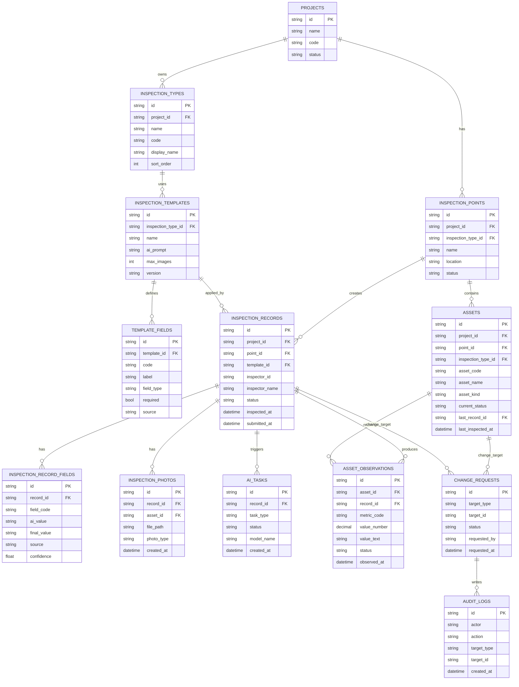
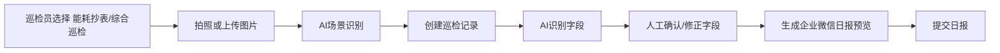
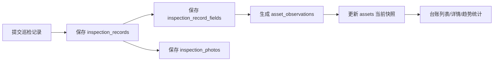
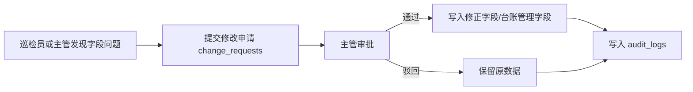

# 紫涵雅集数据库对象图与台账边界设计

> 日期：2026-05-14  
> 目的：在不改代码的前提下，重新明确当前演示范围、数据库对象关系、巡检记录与资产台账的区别，并为后续后端重构提供统一口径。  
> 结论：当前版本建议暂时砍掉“会议中心”，只保留“紫涵雅集”一个项目；前端和汇报口径只展示两个巡检项目：`能耗抄表`、`综合巡检`。`紫涵雅集`作为后台项目归属保留，不再重复出现在巡检项目名称里。

## 1. 当前范围收敛

当前演示不要再展示多个项目和多个机房场景，先把系统做成一个清晰闭环。

### 1.1 保留范围

| 后台项目 | 前端显示巡检项目 | 业务含义 | 是否进入当前演示 |
| --- | --- | --- | --- |
| 紫涵雅集 | 能耗抄表 | Z1/Z2/Z3/Z4 能耗表、生活水表、消防水表读数采集 | 是 |
| 紫涵雅集 | 综合巡检 | 强电井、配电箱、弱电机房、环境温湿度等日常状态检查 | 是 |

### 1.2 暂时移出范围

| 项目 | 场景 | 处理建议 |
| --- | --- | --- |
| 会议中心 | 热水机房 | 暂时不进入演示主线，后续作为扩展场景 |
| 会议中心 | 消防泵房 | 暂时不进入演示主线，后续作为扩展场景 |
| 会议中心 | UPS 机房 | 暂时不进入演示主线，后续作为扩展场景 |

### 1.3 命名口径

| 当前名称 | 建议显示名称 | 说明 |
| --- | --- | --- |
| 紫涵雅集能耗抄表 | 能耗抄表 | 项目归属已经是紫涵雅集，巡检项目名称不再重复项目名 |
| 紫涵雅集每日综合巡检 | 综合巡检 | 名称更短，适合移动端和领导演示 |
| 会议中心热水机房等 | 暂不展示 | 避免当前演示范围发散 |

## 2. 核心概念对照

系统里最容易混淆的是“巡检记录”和“资产台账”。两者必须从数据库层面分开。

| 对象 | 本质 | 保存什么 | 是否长期更新 | 是否允许覆盖 | 页面角色 |
| --- | --- | --- | --- | --- | --- |
| 巡检记录 | 一次填报事实 | 拍照、AI识别、人工确认、日报、提交时间 | 不更新，只追加 | 原则上不覆盖，只允许留痕修正 | 日报、历史记录 |
| 资产台账 | 长期管理对象 | 资产当前状态、最近读数、最近巡检、累计次数 | 持续更新 | 可以更新当前状态，但必须留痕 | 台账、管理后台 |
| 资产观测明细 | 台账和记录的连接层 | 某次巡检对某个资产得到的读数或状态 | 只追加 | 不覆盖 | 趋势、追溯、异常分析 |

一句话：

```text
巡检记录 = 过程和证据
资产台账 = 对象和当前结果
资产观测明细 = 每次记录如何影响每个资产
```

## 3. 原汇报表格与数据库对象映射

原企业微信日报表格更适合作为“输出格式”，不建议直接作为数据库主结构。数据库应该先保存结构化数据，再按日报格式生成展示。

### 3.1 能耗抄表映射

| 原日报字段 | 数据库存放位置 | 是否进入台账 | 说明 |
| --- | --- | --- | --- |
| 巡检日期/时间 | `inspection_records.inspected_at` | 是，更新资产最近巡检时间 | 一次巡检的时间事实 |
| 巡检人 | `inspection_records.inspector_name` | 是，更新资产最近巡检人 | 来自企业微信用户或手填 |
| 巡检地点 | `inspection_records.point_id` / `inspection_points.name` | 是 | 用于确定本次巡检属于哪个点位 |
| Z1 能耗表读数 | `asset_observations.value_number` | 是 | 对应资产 `Z1能耗表` 的一次读数 |
| Z2 能耗表读数 | `asset_observations.value_number` | 是 | 对应资产 `Z2能耗表` 的一次读数 |
| Z3 能耗表读数 | `asset_observations.value_number` | 是 | 对应资产 `Z3能耗表` 的一次读数 |
| Z4 能耗表读数 | `asset_observations.value_number` | 是 | 对应资产 `Z4能耗表` 的一次读数 |
| 生活水表读数 | `asset_observations.value_number` | 是 | 对应资产 `生活水表` 的一次读数 |
| 消防水表读数 | `asset_observations.value_number` | 是 | 对应资产 `消防水表` 的一次读数 |
| 备注 | `inspection_record_fields` 或 `inspection_records.note` | 视情况 | 通常作为本次巡检说明，不直接覆盖资产名称 |
| 图片 | `inspection_photos` | 是，保存最近照片索引 | 图片是证据，不直接存进台账主表 |
| AI总结 | `inspection_records.ai_summary` | 是，更新资产最近摘要 | 台账只保存最近摘要，历史从记录查 |

### 3.2 综合巡检映射

| 原日报字段 | 数据库存放位置 | 是否进入台账 | 说明 |
| --- | --- | --- | --- |
| 巡检日期/时间 | `inspection_records.inspected_at` | 是 | 一次综合巡检事实 |
| 巡检人 | `inspection_records.inspector_name` | 是 | 最近巡检人 |
| 巡检地点 | `inspection_records.point_id` | 是 | 通常为园区或具体区域 |
| 温度 | `inspection_record_fields` / `asset_observations` | 建议进入趋势 | 可作为“环境温湿度”资产的观测值 |
| 湿度 | `inspection_record_fields` / `asset_observations` | 建议进入趋势 | 可作为“环境温湿度”资产的观测值 |
| 强电井室内情况 | `asset_observations.status` | 是 | 对应资产/检查对象 `强电井` |
| 配电箱情况 | `asset_observations.status` | 是 | 对应资产/检查对象 `配电箱` |
| 弱电机房情况 | `asset_observations.status` | 是 | 对应资产/检查对象 `弱电机房` |
| 备注 | `inspection_records.note` | 视情况 | 当前巡检说明，不直接覆盖资产主数据 |
| 图片 | `inspection_photos` | 是 | 作为最近证据和历史证据 |
| AI总结 | `inspection_records.ai_summary` | 是 | 更新综合巡检相关资产最近摘要 |

## 4. 数据库对象总图

下面是建议的目标数据库对象图。这个图不是要求马上全部实现，而是定义后端长期结构。



## 5. 当前版本建议的对象拆分

### 5.1 项目对象

当前只保留一个项目。

| 字段 | 示例 |
| --- | --- |
| `project_id` | `zihan` |
| `project_name` | `紫涵雅集` |
| `project_code` | `zihan` |
| `status` | `active` |

说明：`紫涵雅集`作为后台归属存在，不再重复出现在巡检项目名称中。

### 5.2 巡检类型对象

| `inspection_type_id` | 显示名称 | 后台归属 | 说明 |
| --- | --- | --- | --- |
| `energy_meter` | 能耗抄表 | 紫涵雅集 | 读数型巡检，重点是数值和趋势 |
| `daily_check` | 综合巡检 | 紫涵雅集 | 状态型巡检，重点是正常/异常和证据 |

### 5.3 巡检点位对象

| 点位 ID | 点位名称 | 巡检类型 | 说明 |
| --- | --- | --- | --- |
| `p_energy_meter` | 能耗抄表点位 | 能耗抄表 | 对应 Z1-Z4 电表、生活水表、消防水表 |
| `p_daily_check` | 综合巡检点位 | 综合巡检 | 对应强电井、配电箱、弱电机房、环境 |

说明：第一版可以只有两个点位。后续如果细化到楼层、机房、区域，再扩展点位表，不影响资产台账。

## 6. 资产台账对象设计

资产台账应该保存“长期被管理的对象”，而不是“一次日报”。

### 6.1 能耗抄表台账对象

建议将每块表作为一条资产。

| 资产 ID | 资产名称 | 资产类型 | 关键指标 | 台账价值 |
| --- | --- | --- | --- | --- |
| `asset_z1_energy` | Z1能耗表 | 电表 | kWh读数 | 看每日/每月能耗变化 |
| `asset_z2_energy` | Z2能耗表 | 电表 | kWh读数 | 看每日/每月能耗变化 |
| `asset_z3_energy` | Z3能耗表 | 电表 | kWh读数 | 看每日/每月能耗变化 |
| `asset_z4_energy` | Z4能耗表 | 电表 | kWh读数 | 看每日/每月能耗变化 |
| `asset_living_water` | 生活水表 | 水表 | m³读数 | 看用水变化 |
| `asset_fire_water` | 消防水表 | 水表 | m³读数 | 看消防水系统变化 |

能耗抄表的台账重点不是“正常/异常”本身，而是：

- 最新读数是多少。
- 和上次相比差值多少。
- 是否存在读数倒退。
- 是否存在异常突增。
- 是否连续缺失。
- 是否照片无法识别。

### 6.2 综合巡检台账对象

建议将每个长期检查对象作为一条资产或管理项。

| 资产 ID | 资产名称 | 资产类型 | 关键指标 | 台账价值 |
| --- | --- | --- | --- | --- |
| `asset_strong_room` | 强电井 | 综合巡检项 | 正常/异常 | 看是否反复异常 |
| `asset_distribution_box` | 配电箱 | 综合巡检项 | 正常/异常 | 看电气安全状态 |
| `asset_weak_room` | 弱电机房 | 综合巡检项 | 正常/异常 | 看弱电环境和设备状态 |
| `asset_environment` | 环境温湿度 | 环境指标 | 温度、湿度 | 看环境趋势 |

综合巡检的台账重点是：

- 当前状态是否正常。
- 最近一次异常是什么。
- 异常是否已关闭。
- 最近一次照片证据是什么。
- 哪些对象长期没有巡检。

## 7. 巡检记录对象设计

巡检记录保存“一次巡检全过程”，它是历史证据。

### 7.1 主表：`inspection_records`

| 字段 | 含义 | 示例 |
| --- | --- | --- |
| `id` | 巡检记录ID | `rec_20260514_xxx` |
| `project_id` | 项目ID | `zihan` |
| `inspection_type_id` | 巡检类型ID | `energy_meter` / `daily_check` |
| `point_id` | 点位ID | `p_energy_meter` |
| `template_id` | 使用的模板ID | `tpl_energy_meter_v1` |
| `inspector_id` | 巡检人ID | 企业微信用户ID |
| `inspector_name` | 巡检人姓名 | 周新宇 |
| `recognition_status` | 识别状态 | `recognized` / `manual_required` |
| `review_status` | 人工确认状态 | `pending` / `confirmed` |
| `submit_status` | 提交状态 | `draft` / `submitted` |
| `report_text` | 日报正文 | 企业微信日报格式 |
| `ai_summary` | AI总结 | 本次巡检总结 |
| `created_at` | 创建时间 | 2026-05-14 10:30 |
| `submitted_at` | 提交时间 | 2026-05-14 10:35 |

### 7.2 字段表：`inspection_record_fields`

| 字段 | 含义 |
| --- | --- |
| `record_id` | 所属巡检记录 |
| `field_code` | 字段编码，例如 `z1_reading` |
| `field_label` | 字段显示名，例如 `Z1能耗表读数` |
| `ai_value` | AI识别原值 |
| `final_value` | 人工确认后的最终值 |
| `source` | `ai` / `human_confirmed` / `human_edited` |
| `confidence` | AI置信度 |
| `needs_review` | 是否需要人工复核 |
| `version` | 字段修订版本 |

说明：这个表是“AI是否识别准确”的关键依据。后续可以统计哪个字段最容易错、哪个场景最需要人工确认。

### 7.3 图片表：`inspection_photos`

| 字段 | 含义 |
| --- | --- |
| `record_id` | 所属巡检记录 |
| `asset_id` | 关联资产，可为空 |
| `file_path` | 文件路径 |
| `photo_type` | 原图、补充图、复拍图 |
| `content_hash` | 图片哈希 |
| `created_at` | 上传时间 |

说明：图片是巡检证据，不应该直接塞进资产主表。资产台账只保存最近照片索引，历史照片从记录查。

## 8. 资产观测明细设计

资产观测明细是关键中间层。它解决一个问题：一次巡检记录可能影响多个资产。

例如一次“能耗抄表”会产生 6 条资产观测：

| record | asset | metric | value |
| --- | --- | --- | --- |
| 本次能耗抄表记录 | Z1能耗表 | kWh | 1756.3304 |
| 本次能耗抄表记录 | Z2能耗表 | kWh | 5053.4644 |
| 本次能耗抄表记录 | Z3能耗表 | kWh | 2891.0156 |
| 本次能耗抄表记录 | Z4能耗表 | kWh | 1234.5678 |
| 本次能耗抄表记录 | 生活水表 | m³ | 305 |
| 本次能耗抄表记录 | 消防水表 | m³ | 118 |

一次“综合巡检”会产生多条状态观测：

| record | asset | metric | status |
| --- | --- | --- | --- |
| 本次综合巡检记录 | 强电井 | condition | 正常 |
| 本次综合巡检记录 | 配电箱 | condition | 异常 |
| 本次综合巡检记录 | 弱电机房 | condition | 正常 |
| 本次综合巡检记录 | 环境温湿度 | temperature | 26℃ |
| 本次综合巡检记录 | 环境温湿度 | humidity | 58% |

### 8.1 表：`asset_observations`

| 字段 | 含义 |
| --- | --- |
| `id` | 观测ID |
| `asset_id` | 哪个资产 |
| `record_id` | 来自哪次巡检 |
| `metric_code` | 指标编码，例如 `reading` / `temperature` / `condition` |
| `metric_label` | 指标名称 |
| `value_number` | 数值型结果 |
| `value_text` | 文本型结果 |
| `unit` | 单位，例如 kWh、m³、℃、% |
| `status` | 正常、待复核、异常、待维修 |
| `ai_confidence` | AI置信度 |
| `source` | AI识别或人工确认 |
| `observed_at` | 观测时间 |

### 8.2 为什么必须有这张表

如果没有 `asset_observations`，系统只能做到“最近一次是什么状态”。有了它之后，系统才能回答：

- Z1能耗表最近30天变化趋势是什么。
- 哪个表读数连续缺失。
- 哪个巡检对象最近三次都异常。
- 本次日报里哪些字段最终影响了台账。
- AI识别值和人工修正值差距有多大。

## 9. 资产台账主表设计

资产台账主表只保存当前快照和基础管理信息。

### 9.1 表：`assets`

| 字段 | 含义 | 示例 |
| --- | --- | --- |
| `id` | 资产ID | `asset_z1_energy` |
| `project_id` | 所属项目 | `zihan` |
| `point_id` | 所属点位 | `p_energy_meter` |
| `inspection_type_id` | 所属巡检类型 | `energy_meter` |
| `asset_code` | 资产编码 | `Z1` |
| `asset_name` | 资产名称 | `Z1能耗表` |
| `asset_kind` | 资产类型 | `电表` |
| `location` | 位置 | `园区水电表点位` |
| `current_status` | 当前状态 | `正常` |
| `status_level` | 系统状态等级 | `normal` |
| `last_record_id` | 最近巡检记录 | `rec_xxx` |
| `last_observation_id` | 最近观测明细 | `obs_xxx` |
| `last_value_number` | 最近数值 | `1756.3304` |
| `last_value_text` | 最近文本 | `正常` |
| `last_unit` | 最近单位 | `kWh` |
| `last_inspected_at` | 最近巡检时间 | `2026-05-14 10:30` |
| `last_inspector_name` | 最近巡检人 | `周新宇` |
| `last_photo_id` | 最近照片 | `photo_xxx` |
| `inspection_count` | 累计巡检次数 | `18` |
| `abnormal_count` | 累计异常次数 | `2` |
| `owner_name` | 管理负责人 | 可后续维护 |
| `management_note` | 管理备注 | 可后续维护 |
| `created_at` | 创建时间 | 首次建档时间 |
| `updated_at` | 更新时间 | 最近台账更新时间 |

### 9.2 台账主表不应该保存什么

| 不建议直接放进 `assets` 的内容 | 原因 |
| --- | --- |
| 所有历史读数 | 会导致主表越来越乱，趋势查询困难 |
| 所有历史照片 | 图片应归属巡检记录 |
| AI每次原始识别结果 | 应放在记录字段或AI任务里 |
| 每一次人工修改过程 | 应放在审批和审计表里 |
| 企业微信日报全文历史 | 应放在巡检记录里 |

## 10. 数据流设计

### 10.1 拍照到日报



### 10.2 日报到台账



### 10.3 修改与留痕



## 11. 后台页面如何区分

### 11.1 巡检记录页面

用途：查看每一次日报。

建议字段：

- 巡检时间
- 巡检人
- 巡检类型
- 点位
- 识别状态
- 人工确认状态
- 提交状态
- 日报正文
- 上传照片
- AI总结
- 字段明细

页面重点：

```text
这一次巡检到底填了什么，有哪些照片，AI识别是否被人工改过。
```

### 11.2 资产台账页面

用途：查看每个长期资产/检查对象的当前状态。

建议字段：

- 资产名称
- 资产类型
- 所属巡检类型
- 当前状态
- 最近读数/结果
- 最近巡检时间
- 最近巡检人
- 巡检次数
- 异常次数
- 最近照片
- 管理备注

页面重点：

```text
这个资产当前怎么样，最近谁查过，历史是否反复异常。
```

### 11.3 能耗趋势页面

用途：专门看读数型资产。

建议展示：

- Z1/Z2/Z3/Z4 每日读数
- 生活水表、消防水表每日读数
- 与上次差值
- 异常突增提示
- 读数倒退提示
- 缺失记录提示

这个页面不一定第一版做，但数据库结构要支持。

## 12. 对当前代码的迁移建议

当前实现中大致已有这些概念：

| 当前对象 | 当前作用 | 目标对象 |
| --- | --- | --- |
| `records` | 每次巡检记录，字段JSON和图片JSON | `inspection_records` + `inspection_record_fields` + `inspection_photos` |
| `assets` | 最近一次台账快照 | `assets` |
| `ai_tasks` | AI任务 | `ai_tasks` |
| `change_requests` | 修改申请 | `change_requests` |
| 写死的 `reportTemplates()` | 模板定义 | `inspection_templates` + `template_fields` |
| 写死的 `seedPoints()` | 点位定义 | `inspection_points` |

### 12.1 第一阶段，不急着全量拆表

如果短期仍以演示为主，可以先保持当前 `records.fields_json` 和 `records.images_json`，但要先统一口径：

- 前端只显示 `能耗抄表`、`综合巡检`。
- 后台项目仍是 `紫涵雅集`。
- 会议中心不进入主导航、不进入台账统计。
- 台账列表按资产对象显示，不按日报显示。
- 能耗抄表台账应拆成 6 个表对象。
- 综合巡检台账应拆成若干检查对象。

### 12.2 第二阶段，补中间表

建议优先补 `asset_observations`。

原因：

- 它不破坏现有 `records`。
- 它能立刻支撑趋势分析。
- 它能让一次日报影响多个资产。
- 它能解决“一个资产等于一条日报”的错误模型。

### 12.3 第三阶段，模板和点位入库

等演示稳定后，再把写死配置迁移到数据库：

- `projects`
- `inspection_types`
- `inspection_points`
- `inspection_templates`
- `template_fields`

这样后期新增项目、新增点位、新增字段，不需要改代码。

## 13. 当前演示口径建议

对领导讲解时建议这样说：

> 当前版本先聚焦紫涵雅集两个高频场景：能耗抄表和综合巡检。  
> 能耗抄表负责把电表、水表读数从照片中识别出来，形成日报，同时沉淀每块表的历史读数台账。  
> 综合巡检负责检查强电井、配电箱、弱电机房和现场环境状态，形成日报，同时沉淀每个检查对象的当前状态和历史异常记录。  
> 巡检记录保留每次填报过程和照片证据，资产台账沉淀长期管理结果，两者分开后，既能还原日报，也能做趋势和异常追踪。

## 14. 给 Claude / Codex 的执行口径

后续如果进入代码改造，应按以下原则执行：

1. 不再新增会议中心相关演示入口。
2. 保留项目 `紫涵雅集`，但前端巡检项目显示为 `能耗抄表`、`综合巡检`。
3. 不要把一次日报直接当成一个资产。
4. 能耗抄表要拆成 6 个资产对象。
5. 综合巡检要拆成多个检查对象。
6. `inspection_records` 只负责保存一次巡检事实。
7. `assets` 只负责保存长期对象当前快照。
8. `asset_observations` 负责连接“本次巡检记录”和“具体资产”。
9. 修改历史事实必须走审批和审计，不应直接覆盖原记录。
10. 原企业微信日报表格只作为输出格式，不作为数据库主结构。

## 15. 最终推荐结构

```text
紫涵雅集
├─ 能耗抄表
│  ├─ 巡检记录：每天/每次抄表日报
│  ├─ 资产台账：Z1、Z2、Z3、Z4、生活水表、消防水表
│  └─ 观测明细：每次读数、差值、异常判断
│
└─ 综合巡检
   ├─ 巡检记录：每天/每次综合巡检日报
   ├─ 资产台账：强电井、配电箱、弱电机房、环境温湿度
   └─ 观测明细：每次状态、照片证据、异常说明
```

这个结构的优势是：

- 演示范围清楚。
- 后端对象边界清楚。
- 原日报表格能继续生成。
- 台账能长期沉淀。
- 后续接企业微信、云服务器、智能穿戴设备时，不需要推倒重来。
