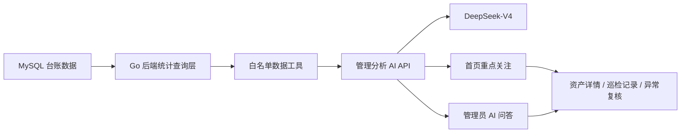

# 管理后台 DeepSeek-V4 历史分析与问答实施方案（2026-05-31）

## 1. 本次改动目标

领导提出的方向是正确的：看板不能只展示静态数字，还要把历史台账转化为“管理者今天应该关注什么”。

本次建议增加一个独立的“管理分析 AI”能力：

```text
历史台账数据
-> 后端规则聚合
-> DeepSeek-V4 分析解释
-> 首页重点关注列表
-> 管理员可继续向 AI 追问后台数据
```

核心目标：

1. 首页展示最近需要重点关注的资产和巡检事项。
2. 管理员可以在首页直接询问后台数据。
3. AI 回答必须基于真实台账证据，不允许凭空生成。
4. 视觉识别继续使用千问视觉模型，管理分析单独使用 DeepSeek-V4。

## 2. 当前系统已有能力

### 已有数据底座

当前后端已经具备：

```text
assets
inspection_records
asset_snapshots
field_observations
field_confirm_logs
change_requests
operation_logs
```

其中：

- `asset_snapshots` 可以支撑设备历史状态查询。
- `field_observations` 可以支撑数值趋势查询。
- `field_confirm_logs` 可以支撑人工复核质量分析。
- `change_requests` 可以支撑整改、补传、审批状态查询。

### 已有首页 AI 问答

当前管理后台首页已有“AI 智能问答”输入框：

```text
admin-frontend/app.js
-> POST /api/ai/chat
-> go-backend handleAIChat()
-> ai-service /chat
-> QWEN_TEXT_MODEL=qwen-plus
```

### 当前不足

现有 AI 问答只会收到少量汇总数字：

```text
assetTotal
assetNormal
assetWarning
assetDanger
recordTotal
changeRequestPending
```

因此它只能回答：

```text
今天有几个异常？
目前有几个待审批？
```

它无法可靠回答：

```text
最近哪些电梯需要重点关注？
某台无机房电梯近 30 天有哪些重复风险？
本周和上周相比，异常是否增加？
哪些巡检员经常漏拍或快速跳过确认？
哪类设备最近重复出现同一种问题？
```

## 3. 模型选择

截至 2026-05-31，DeepSeek 官方 API 已支持：

```text
deepseek-v4-pro
deepseek-v4-flash
```

官方文档：

- https://api-docs.deepseek.com/zh-cn/
- https://api-docs.deepseek.com/zh-cn/news/news260424
- https://api-docs.deepseek.com/guides/tool_calls
- https://api-docs.deepseek.com/zh-cn/guides/json_mode/

建议：

```text
定时生成首页重点关注报告：
deepseek-v4-pro
thinking enabled
reasoning_effort=high

管理员实时追问：
deepseek-v4-flash
thinking disabled
```

原因：

- 首页重点关注报告需要质量，允许稍慢。
- 管理员实时问答更关注响应速度。
- 两者都属于 DeepSeek-V4 系列。
- 不建议继续使用 `deepseek-chat` 旧模型名。官方说明该名称将在 2026-07-24 弃用。

## 4. 服务边界：不要让大模型直接连接数据库

不要把 MySQL 账号、SQL 执行权限或完整原始表直接交给 DeepSeek。

推荐结构：



职责分工：

```text
Go 后端：
- 查询真实数据
- 计算基础统计
- 限制查询范围
- 做权限校验
- 记录审计日志

DeepSeek-V4：
- 理解管理员问题
- 选择允许调用的数据工具
- 基于数据生成摘要和建议
- 不直接执行 SQL
- 不修改资产台账
```

## 5. 推荐接口设计

### 5.1 管理端对外 API

新增：

```text
GET  /api/management-ai/attention?range=30d&project=
POST /api/management-ai/chat
POST /api/management-ai/reports/refresh
GET  /api/management-ai/reports/latest?range=30d&project=
```

接口用途：

```text
/attention
- 首页加载重点关注资产
- 默认只返回前 5 条

/chat
- 管理员首页问答
- 回答附带证据和跳转目标

/reports/refresh
- 手动刷新管理分析
- 仅主管 / 管理员可以调用

/reports/latest
- 读取最近一次已缓存的 DeepSeek 分析报告
```

### 5.2 管理 AI 内部 API

为了保持现有架构简单，不建议再开新的公网端口。

可以继续使用现有 `ai-service` 容器，在内部增加逻辑隔离的接口：

```text
POST /management/analyze
POST /management/chat
```

公网只经过 Go 后端：

```text
浏览器
-> Go 后端 /api/management-ai/*
-> ai-service /management/*
-> DeepSeek API
```

这样仍然满足“管理 AI 独立为一个 API”，但不会增加新的公网暴露端口，也不会影响当前千问视觉识别链路。

## 6. 后端白名单数据工具

DeepSeek 官方支持 Tool Calls。管理 AI 不直接访问数据库，而是只能使用以下白名单工具：

```text
get_overview
- 参数：range, project
- 返回：资产总数、正常数、待复核数、异常数、巡检数、审批数

list_attention_assets
- 参数：range, project, assetType, limit
- 返回：重点关注资产、风险原因、证据记录

get_asset_history
- 参数：assetId, range, limit
- 返回：某资产历史状态、异常字段、整改记录

compare_asset_periods
- 参数：assetId, currentRange, previousRange
- 返回：本期与上期对比

list_repeated_issues
- 参数：range, project, limit
- 返回：重复出现的问题和资产

list_pending_reviews
- 参数：project, limit
- 返回：待复核资产、待审批修改申请

get_inspector_quality
- 参数：range, project
- 返回：补拍次数、无法判定次数、未看图确认次数、快速确认次数

get_record_detail
- 参数：recordId
- 返回：单条巡检记录、字段、图片数量、AI 摘要、人工复核留痕
```

注意：

- DeepSeek 只能选择调用工具。
- 工具由 Go 后端执行。
- 工具只能返回经过脱敏和限量的数据。
- 所有工具调用写入 `operation_logs`。
- 首页问答默认只读，不能直接修改台账、审批或派单。

## 7. 首页重点关注怎么计算

不要让 DeepSeek 自己凭感觉挑选资产。先由 Go 后端计算可解释的风险分，再把前 20 条候选交给 DeepSeek 做管理摘要。

建议风险分：

```text
资产当前状态 = 异常                  +60
资产当前状态 = 待复核                +35
近 30 天重复异常，每次               +12
同一字段重复异常，每次               +15
近 30 天需要补拍，每次               +8
近 30 天人工无法判定，每次           +8
近 30 天人工修改 AI 识别值，每次     +5
数值字段变化率超过阈值               +20
超过计划周期未巡检                   +25
```

首页重点关注接口返回：

```json
{
  "generatedAt": "2026-05-31T10:00:00+08:00",
  "range": "30d",
  "items": [
    {
      "assetId": "会议中心::elevator_no_room::HYZX-WJ-DT01",
      "assetName": "无机房电梯",
      "riskScore": 72,
      "riskLevel": "warning",
      "title": "按钮面板状态需要持续关注",
      "reasons": [
        "近 30 天出现 2 次按钮与显示待复核",
        "最近一次巡检存在面板照片补传记录"
      ],
      "action": "下次巡检重点补拍按钮面板正面特写，并复核指示灯状态",
      "evidence": [
        { "type": "record", "id": "rec_xxx", "time": "2026-05-22 15:47" }
      ]
    }
  ]
}
```

首页展示建议：

```text
AI 重点关注

1. 无机房电梯 · 待复核
   近 30 天重复出现 2 次按钮面板状态待确认
   建议：下次巡检补拍面板正面照
   [查看资产] [查看依据]

2. 配电箱 · 需关注
   最近 7 天人工修正 3 次 AI 识别结果
   建议：优化拍摄角度，并安排主管抽检
   [查看记录]
```

## 8. 电梯场景重点：增加状态事件趋势

当前 `field_observations` 已经适合能耗表和温湿度数值折线，但电梯巡检主要是状态字段，不能只做数值趋势。

建议新增“电梯状态事件统计”：

```text
近 7 / 30 天巡检次数
正常次数
待复核次数
异常次数
补拍次数
人工无法判定次数
重复异常字段
最近一次异常
最近一次整改结果
```

示例：

```text
无机房电梯 HYZX-WJ-DT01

近 30 天巡检 11 次
- 正常：8 次
- 待复核：2 次
- 异常：1 次
- 补拍：2 次

重复风险：
- 按钮与显示：2 次待复核
- 层门 / 轿门运行：1 次异常

AI 建议：
下次巡检优先补拍按钮面板正面照，并复核层门闭合过程。
```

## 9. 管理员首页问答

首页已有输入框，可以复用 UI，但要替换后端能力和展示文案。

当前展示：

```text
Qwen Plus · 实时
```

建议改成：

```text
DeepSeek-V4 · 台账分析
```

推荐问题：

```text
最近 30 天有哪些电梯需要重点关注？
无机房电梯最近有哪些重复风险？
本周异常资产比上周增加了吗？
有哪些记录需要主管复核？
哪些巡检存在漏拍或人工快速跳过？
今天应该优先处理什么？
```

返回内容必须包含：

```text
结论
依据
建议动作
可点击证据
数据更新时间
```

示例：

```json
{
  "reply": "最近 30 天建议优先关注无机房电梯 HYZX-WJ-DT01。该设备出现 2 次按钮面板状态待复核，并有 1 次补传照片记录。建议下次巡检补拍按钮面板正面特写。",
  "model": "deepseek-v4-flash",
  "generatedAt": "2026-05-31T10:00:00+08:00",
  "evidence": [
    { "type": "asset", "id": "会议中心::elevator_no_room::HYZX-WJ-DT01", "label": "查看资产" },
    { "type": "record", "id": "rec_xxx", "label": "查看巡检记录" }
  ]
}
```

## 10. DeepSeek 配置

新增环境变量：

```text
DEEPSEEK_API_KEY=
DEEPSEEK_BASE_URL=https://api.deepseek.com
DEEPSEEK_REPORT_MODEL=deepseek-v4-pro
DEEPSEEK_CHAT_MODEL=deepseek-v4-flash
DEEPSEEK_TIMEOUT_SECONDS=30
```

Docker 中建议继续使用 Secret 文件：

```text
DEEPSEEK_API_KEY_FILE=/run/secrets/deepseek_api_key
```

不要把密钥写进：

```text
Git
前端 JavaScript
浏览器 LocalStorage
日志
数据库普通配置表
```

## 11. 建议新增缓存表

首页重点关注报告不需要每次打开页面都重新调用 DeepSeek。

建议新增：

```sql
CREATE TABLE management_ai_reports (
    id               VARCHAR(64)  NOT NULL PRIMARY KEY,
    report_type      VARCHAR(32)  NOT NULL,
    project          VARCHAR(128) NOT NULL DEFAULT '',
    range_key        VARCHAR(16)  NOT NULL DEFAULT '30d',
    facts_json       MEDIUMTEXT   NOT NULL,
    summary          MEDIUMTEXT   NOT NULL,
    recommendations  MEDIUMTEXT   NOT NULL,
    evidence_json    MEDIUMTEXT   NOT NULL,
    model            VARCHAR(64)  NOT NULL,
    prompt_version   VARCHAR(32)  NOT NULL,
    generated_at     VARCHAR(40)  NOT NULL,
    expires_at       VARCHAR(40)  NOT NULL,
    INDEX idx_management_ai_latest (report_type, project, range_key, generated_at)
);
```

建议刷新策略：

```text
默认每 30 分钟生成一次
新异常提交后触发一次异步刷新
主管可点击“刷新分析”
首页优先展示缓存，避免打开页面时等待模型
```

## 12. 管理 AI Prompt 原则

系统提示词必须约束：

```text
你是设备巡检管理分析助手。
只能基于工具返回的数据回答。
不得猜测不存在的数据。
不得自行修改台账、审批或派发任务。
如果数据不足，明确说“暂无足够数据”。
优先输出：结论、依据、建议动作。
每个风险结论必须引用 evidence 中的资产或记录 ID。
区分“异常”“待复核”“趋势预警”，不要混用。
```

DeepSeek 输出建议使用 JSON Output：

```json
{
  "summary": "",
  "attentionAssets": [],
  "recommendations": [],
  "evidence": []
}
```

官方说明 JSON Output 需要：

```text
response_format = {"type": "json_object"}
prompt 中明确要求输出 json
合理设置 max_tokens
处理偶发空 content 的重试
```

## 13. 权限和安全

### 必须限制

```text
管理员 / 主管：
- 查看全局重点关注
- 使用管理 AI 问答
- 查看证据记录

巡检员：
- 只看本人任务和本人记录
- 不允许访问全局管理 AI
```

### 必须脱敏

管理 AI 不需要接收：

```text
原图文件
图片公网 URL
手机号
密码
Token
MySQL DSN
DeepSeek Key
```

管理 AI 只接收：

```text
资产 ID
资产名称
时间
状态
字段标签
字段值
风险原因
审批状态
脱敏后的巡检人标识
```

## 14. 实施顺序

### 第一阶段：最小可用版

1. 增加 DeepSeek 环境变量和调用封装。
2. 增加 `/management/chat` 内部接口。
3. Go 后端增加只读工具查询层。
4. 改造 `/api/ai/chat` 或新增 `/api/management-ai/chat`。
5. 首页 AI 问答标签改为 `DeepSeek-V4 · 台账分析`。
6. 支持问题：

```text
最近异常资产
待复核记录
某资产历史
最近重点关注
本周与上周异常对比
```

### 第二阶段：首页重点关注

1. 后端增加风险评分。
2. 增加 `/api/management-ai/attention`。
3. 首页新增前 5 条重点关注卡片。
4. 每条卡片可跳转资产详情或巡检记录。

### 第三阶段：生产化

1. 增加 `management_ai_reports` 缓存表。
2. 增加定时刷新和异常提交触发刷新。
3. 增加 Tool Calls。
4. 增加权限、脱敏、审计日志。
5. 增加 DeepSeek 调用失败降级策略。
6. 增加接口测试和端到端回归。

## 15. 验收标准

必须能稳定回答：

```text
最近 30 天有哪些电梯需要重点关注？
为什么需要关注？
依据是哪几条巡检记录？
无机房电梯最近一个月有哪些重复问题？
本周异常数量比上周增加了吗？
目前有哪些待复核事项？
哪些巡检员经常漏拍或没有查看原图？
```

必须满足：

```text
每个 AI 结论可点击追溯到资产或巡检记录
没有数据时明确返回暂无数据
DeepSeek 不直接访问数据库
DeepSeek 不具备写入和审批权限
DeepSeek API 失败时首页仍可展示后端规则生成的重点关注列表
```

## 16. 给 Claude 的直接实现要求

请不要直接把完整数据库数据塞进 prompt，也不要让 DeepSeek 自由执行 SQL。

优先实现：

1. 保留千问视觉识别链路不动。
2. 新增 DeepSeek-V4 管理分析调用封装。
3. 新增 Go 后端白名单查询工具。
4. 新增首页重点关注接口和卡片。
5. 新增管理员问答接口，返回结论、依据、建议动作、证据跳转。
6. 电梯场景优先做状态事件趋势，不要只做数值折线。
7. 不新增公网端口，管理 AI 继续通过现有 Go 后端转发。

