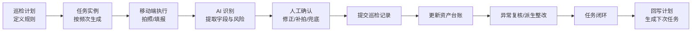
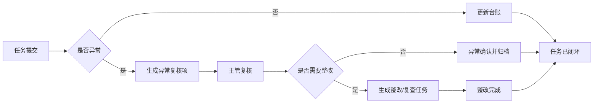
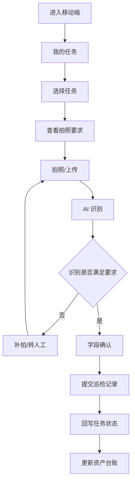

# 巡检计划与巡检任务闭环设计方案书

日期：2026-06-05  
项目：JADEAST 智巡  
范围：管理后台「巡检计划」「巡检任务」及移动端执行闭环

---

## 1. 当前现状判断

当前系统已经具备「巡检计划」和「巡检任务」两个页面，但它们仍偏演示态，距离生产闭环还有明显差距。

### 1.1 当前已有能力

- 管理端可以创建巡检计划，字段包含项目、点位、模板、频次、责任人、AI 策略等。
- 计划启用后，前端会通过 `syncPlanTask(plan)` 自动生成一个对应任务。
- 任务页面按「待执行 / 进行中 / 已完成 / 逾期」展示任务卡片。
- 任务详情支持「开始执行 / 标记完成 / 取消任务 / 重新打开」。
- 巡检记录、资产台账、异常复核、AI 识别已经是系统已有模块。

### 1.2 当前关键缺口

- 计划和任务主要保存在管理端 `localStorage`，不是后端数据库正式对象。
- 后端目前有 `ai_tasks`，但这是 AI 分析任务，不是业务巡检任务。
- `inspection_records` 有 `taskId` 字段，但当前计划任务没有完整写入、查询、状态流转和闭环校验。
- 任务「标记完成」只是前端状态变化，没有强制绑定巡检记录、照片、AI 识别结果、人工确认、资产台账更新。
- 计划只同步生成一个任务，没有真正按照频次生成每日/每周/每月任务实例。
- 逾期、漏检、补拍、复核、异常处理没有统一闭环口径。

结论：现在的计划和任务可以用于展示，但还不能作为生产级巡检调度和闭环管理核心。

---

## 2. 设计目标

巡检计划和巡检任务需要从「页面功能」升级为「业务闭环中枢」。

目标不是简单多加按钮，而是建立一条可追踪链路：

---

## 3. 计划与任务的职责边界

### 3.1 巡检计划是什么

巡检计划是长期规则，不是一次具体工作。

它回答：

- 哪个项目要巡检？
- 哪个点位或资产要巡检？
- 用哪个日报模板？
- 多久巡检一次？
- 谁负责？
- 拍照和 AI 识别标准是什么？
- 什么情况必须复核？
- 下次什么时候生成任务？

### 3.2 巡检任务是什么

巡检任务是某一次具体执行工单。

它回答：

- 今天谁要去哪个点位？
- 截止时间是什么？
- 是否已经开始？
- 是否已经拍照？
- AI 是否识别成功？
- 是否人工确认？
- 是否提交了巡检记录？
- 是否更新了资产台账？
- 异常是否处理完？
- 最终是否闭环？

### 3.3 设计原则

- 计划不直接代表完成情况，只负责生成任务。
- 任务必须绑定一次或多次巡检记录。
- 巡检记录提交后，任务不一定自动闭环；必须经过闭环校验。
- 资产台账是结果沉淀，不是任务本身。
- 异常处理必须能反向影响任务状态。

---

## 4. 推荐状态体系

之前页面里出现过「已识别」「已提交」这类状态，容易混淆。建议拆成三条状态线。

### 4.1 任务主状态

用于管理者看任务闭环。

| 状态 | 含义 |
| --- | --- |
| 待执行 | 已生成任务，但巡检员未开始 |
| 进行中 | 巡检员已开始采集 |
| 待复核 | AI 识别完成，但需要人工确认或主管复核 |
| 需补拍 | 照片不足、角度不合格、关键项缺失 |
| 异常待处理 | 已发现异常，未完成复核或整改闭环 |
| 已闭环 | 记录、台账、异常处理均完成 |
| 已逾期 | 超过截止时间仍未闭环 |
| 已取消 | 管理员取消，不参与完成率 |

### 4.2 AI 识别状态

用于解释系统识别过程。

| 状态 | 含义 |
| --- | --- |
| 未识别 | 还没有上传照片或未触发 AI |
| 识别中 | AI 正在处理 |
| 已识别 | AI 已输出字段和建议 |
| 需补拍 | AI 判断证据不足 |
| 转人工 | 超过补拍次数或识别置信度过低 |
| 识别失败 | API 或模型异常 |

### 4.3 巡检记录状态

用于说明数据是否正式入库。

| 状态 | 含义 |
| --- | --- |
| 草稿 | 已采集但未提交 |
| 待确认 | AI 填好字段，等待人工确认 |
| 已提交 | 巡检记录已正式提交 |
| 已修正 | 提交后经过申请修改 |
| 已作废 | 管理员作废记录 |

关键要求：后台筛选不能只用「已提交 / 已识别」，必须有「正常 / 异常 / 待复核 / 需补拍 / 已闭环」这类业务状态。

---

## 5. 数据对象设计

### 5.1 inspection_plans：巡检计划表

建议新增后端正式表。

| 字段 | 说明 |
| --- | --- |
| id | 计划 ID |
| project_code / project_name | 项目 |
| point_id / point_name | 点位 |
| asset_scope | 资产范围：单资产 / 点位 / 类型 |
| template_id / template_name | 日报模板 |
| frequency_type | daily / weekly / monthly / custom |
| schedule_rule | 频次规则，可先用简单文本，后续升级 RRULE |
| owner_user_id / owner_name | 默认责任人 |
| reviewer_user_id / reviewer_name | 默认复核人 |
| ai_policy | AI 策略 |
| quality_gate | 置信度阈值、补拍规则 |
| photo_rule | 必拍照片要求 |
| abnormal_rule | 异常判定规则 |
| status | draft / active / paused / archived |
| next_run_at | 下次生成任务时间 |
| last_run_at | 最近生成任务时间 |
| last_completed_at | 最近完成时间 |
| created_by / updated_by | 操作人 |
| created_at / updated_at | 时间 |

### 5.2 inspection_tasks：巡检任务实例表

这是生产闭环的核心表。

| 字段 | 说明 |
| --- | --- |
| id | 任务 ID |
| plan_id | 来源计划 |
| task_no | 任务编号 |
| project_code / project_name | 项目 |
| point_id / point_name | 点位 |
| asset_id / asset_name | 资产，可为空 |
| template_id / template_name | 模板 |
| assignee_id / assignee_name | 巡检员 |
| reviewer_id / reviewer_name | 复核人 |
| due_at | 截止时间 |
| started_at | 开始时间 |
| submitted_at | 巡检记录提交时间 |
| closed_at | 闭环时间 |
| status | 任务主状态 |
| ai_status | AI 状态 |
| record_id | 绑定巡检记录 |
| asset_snapshot_id | 绑定资产快照 |
| exception_id | 绑定异常复核/整改项 |
| photo_count | 照片数量 |
| required_photo_count | 必拍照片数量 |
| ai_confidence | AI 总体置信度 |
| manual_confirmed | 是否人工确认 |
| close_result | normal / abnormal_closed / canceled |
| close_reason | 闭环说明 |
| created_at / updated_at | 时间 |

### 5.3 inspection_task_events：任务流转日志

用于审计和复盘。

| 字段 | 说明 |
| --- | --- |
| id | 事件 ID |
| task_id | 任务 ID |
| event_type | created / assigned / started / photo_uploaded / ai_done / submitted / abnormal_created / closed |
| operator_id / operator_name | 操作人 |
| before_status / after_status | 状态变化 |
| note | 备注 |
| payload_json | 附加数据 |
| created_at | 时间 |

### 5.4 task_quality_checks：任务质量校验

用于解决“人工惰性”和“AI 不一定精准”的问题。

| 字段 | 说明 |
| --- | --- |
| id | 校验 ID |
| task_id | 任务 ID |
| rule_code | 规则编码 |
| rule_name | 规则名称 |
| result | pass / fail / warning |
| message | 说明 |
| evidence_json | 证据 |
| created_at | 时间 |

---

## 6. 闭环规则设计

任务不能靠人工点击「标记完成」直接闭环，必须通过系统校验。

### 6.1 自动闭环条件

同时满足以下条件，任务才能进入「已闭环」：

- 已绑定正式巡检记录 `record_id`。
- 巡检记录状态为「已提交」。
- 必拍照片数量满足计划要求。
- AI 状态为「已识别」或「转人工后人工已确认」。
- 所有必填字段已确认。
- AI 低置信字段已被人工确认或修正。
- 资产台账已更新，生成资产快照。
- 没有未处理异常；如果有异常，必须已经进入复核/整改闭环。

### 6.2 不允许闭环的情况

- 只有任务状态改成「已完成」，但没有巡检记录。
- 有 AI 识别结果，但未人工确认。
- 有照片，但缺少关键角度。
- 有异常，但未创建异常复核。
- 有修改申请，但还未审批。
- 逾期任务被直接取消，没有取消原因。

### 6.3 异常闭环

如果 AI 或人工确认发现异常：

---

## 7. 页面功能改造建议

### 7.1 巡检计划页面

计划页面要从“配置列表”升级为“规则管理中心”。

建议保留：

- 计划总数
- 启用计划
- 今日应执行
- 逾期未生成或未闭环

建议新增：

- 计划状态：未配置 / 启用 / 暂停 / 已归档。
- 最近执行结果：正常 / 异常 / 漏检 / 无记录。
- 今日任务数、已闭环数、逾期数。
- 下次执行时间。
- 计划详情右栏：基础信息、执行规则、AI 规则、最近 5 次任务。

计划详情操作：

- 编辑计划
- 暂停计划
- 手动生成今日任务
- 查看该计划任务历史
- 查看该计划关联资产台账

不要让计划页面承担“完成任务”的动作，它只负责规则、排程和追踪。

### 7.2 巡检任务页面

任务页面要从“任务看板”升级为“闭环处理台”。

建议主视图分组：

- 今日待办
- 进行中
- 待复核
- 异常待处理
- 已闭环
- 已逾期

每个任务卡片必须显示：

- 项目 / 点位 / 资产
- 巡检人
- 截止时间
- 任务状态
- AI 状态
- 照片数量
- 是否已提交巡检记录
- 是否影响资产台账

任务详情右栏建议展示：

- 任务基础信息
- 执行时间线
- 移动端上传照片
- AI 识别摘要
- 人工确认情况
- 关联巡检记录
- 关联资产台账
- 关联异常复核
- 闭环校验结果

任务详情操作：

- 派发 / 改派
- 开始执行
- 催办
- 要求补拍
- 转人工填写
- 发起复核
- 关闭任务
- 重开任务

其中「关闭任务」必须调用后端闭环校验，不允许纯前端改状态。

---

## 8. 移动端执行闭环

移动端应该从“拍照识别入口”升级为“我的任务入口”。

建议流程：

移动端重点不是多做页面，而是每条记录必须带上 `taskId`，这样后台才能知道这次巡检是在完成哪一个任务。

---

## 9. AI 在计划与任务闭环中的作用

AI 不应该只做“识别字段”，还要参与任务质量判断。

### 9.1 任务执行前

- 根据计划要求提示巡检员需要拍哪些照片。
- 根据资产历史提醒重点关注项。
- 根据过去异常生成本次巡检注意事项。

### 9.2 任务执行中

- 判断照片是否覆盖关键角度。
- 提取设备状态、读数、环境、风险。
- 对低置信字段提示人工重点核对。
- 对缺失项提示补拍。

### 9.3 任务提交后

- 生成巡检总结。
- 与历史台账对比，判断趋势变化。
- 判断是否需要异常复核。
- 给主管生成关注建议。

### 9.4 AI 不能替代的部分

- 不能直接代替人工确认关键字段。
- 不能绕过低置信字段复核。
- 不能直接消除异常。
- 不能直接闭环任务，闭环必须经过规则校验。

---

## 10. 解决“人工惰性”的机制

领导提出的“人工二次校正不一定真的看”是关键问题。建议从系统机制上约束。

### 10.1 必须记录人工确认行为

每次字段确认要记录：

- 确认人
- 确认时间
- 是否打开原图
- 停留时长
- AI 原始值
- 人工最终值
- 是否修改

### 10.2 高风险字段强制看图

以下情况不能一键确认：

- AI 置信度低于阈值。
- 数值字段变化超过历史阈值。
- 状态字段异常。
- 图片缺少关键角度。
- 该资产近期多次异常。

### 10.3 抽检机制

- 管理员可以设置每日抽检比例。
- 抽检任务必须由主管复核原图和字段。
- 抽检结果计入巡检员质量榜。

### 10.4 留痕反制

后台数据看板应显示：

- 未看图确认次数。
- 快速确认小于 2 秒次数。
- AI 低置信字段未修改次数。
- 人工修改后仍被主管驳回次数。

这样可以把“人工有没有认真看”转成可度量指标。

---

## 11. 后端 API 建议

### 11.1 计划 API

- `GET /api/inspection/plans`
- `POST /api/inspection/plans`
- `GET /api/inspection/plans/:id`
- `PUT /api/inspection/plans/:id`
- `POST /api/inspection/plans/:id/pause`
- `POST /api/inspection/plans/:id/resume`
- `POST /api/inspection/plans/:id/generate-task`
- `GET /api/inspection/plans/:id/tasks`

### 11.2 任务 API

- `GET /api/inspection/tasks`
- `POST /api/inspection/tasks`
- `GET /api/inspection/tasks/:id`
- `POST /api/inspection/tasks/:id/assign`
- `POST /api/inspection/tasks/:id/start`
- `POST /api/inspection/tasks/:id/request-retake`
- `POST /api/inspection/tasks/:id/submit-record`
- `POST /api/inspection/tasks/:id/close`
- `POST /api/inspection/tasks/:id/reopen`
- `GET /api/inspection/tasks/:id/events`

### 11.3 移动端 API

- `GET /api/mobile/my-tasks`
- `GET /api/mobile/tasks/:id`
- `POST /api/mobile/tasks/:id/photos`
- `POST /api/mobile/tasks/:id/recognize`
- `POST /api/mobile/tasks/:id/confirm-fields`
- `POST /api/mobile/tasks/:id/submit`

---

## 12. 分阶段实施建议

### 第一阶段：后端对象落库

目标：让计划和任务从 `localStorage` 迁到数据库。

交付：

- 新增 `inspection_plans`。
- 新增 `inspection_tasks`。
- 新增 `inspection_task_events`。
- 新增计划/任务 CRUD API。
- 管理后台读取后端 API，不再只读本地缓存。

### 第二阶段：任务与移动端记录打通

目标：移动端提交记录必须绑定任务。

交付：

- 移动端增加“我的任务”入口。
- 选择任务后进入拍照识别。
- 巡检记录写入 `taskId`。
- 提交记录后回写任务状态。

### 第三阶段：闭环校验

目标：不能再人工随便点完成。

交付：

- 新增任务闭环校验函数。
- 校验照片、AI、人工确认、台账、异常复核。
- 未通过时给出明确原因。
- 通过后任务进入「已闭环」。

### 第四阶段：计划自动排程

目标：计划按频次自动生成任务。

交付：

- 启动时检查今日任务。
- 每日/每周/每月自动生成任务实例。
- 避免重复生成。
- 计划页面显示最近执行与下次执行。

### 第五阶段：AI 管理分析

目标：主管可以看计划执行质量和任务风险。

交付：

- 首页 AI 问答支持查询任务、计划、异常。
- 数据看板显示计划完成率、漏检率、复核率。
- AI 自动生成“今日重点关注任务”。

---

## 13. 验收标准

一轮完整交付应满足以下演示链路：

1. 管理员创建「无机房电梯日常巡检计划」。
2. 系统根据计划生成今日巡检任务。
3. 巡检员在移动端看到自己的任务。
4. 巡检员进入任务，按要求拍照。
5. AI 识别电梯状态和关键字段。
6. 人工确认字段，低置信字段必须看图。
7. 提交巡检记录。
8. 后端自动更新资产台账。
9. 如果正常，任务自动进入已闭环。
10. 如果异常，自动进入异常复核，任务保持异常待处理。
11. 主管在任务页面能看到完整时间线。
12. 计划页面能看到最近执行结果和下次执行时间。
13. 数据看板能统计完成率、逾期率、异常率。

---

## 14. 对当前项目的改造优先级

建议优先级如下：

### P0 必须做

- 后端新增正式计划表、任务表。
- 任务绑定巡检记录。
- 任务闭环不能只靠前端状态。
- 巡检任务页面增加待复核、需补拍、异常待处理。

### P1 应该做

- 移动端增加“我的任务”入口。
- 计划自动生成任务实例。
- 任务事件时间线。
- 任务闭环校验结果展示。

### P2 后续增强

- 复杂排程规则。
- 任务改派、催办。
- 主管抽检机制。
- AI 管理问答读取计划和任务数据。

---

## 15. 一句话定位

巡检计划是规则，巡检任务是工单，巡检记录是证据，资产台账是沉淀，异常复核是闭环保障。

如果这五个对象打通，系统才真正从“AI 拍照填报工具”升级为“设备巡检闭环管理平台”。

